:tocdepth: 2

==================
First Graphics App
==================

A step-by-step guide to publishing a standalone story from a dataset.

This tutorial will show you how journalists at America’s top news organizations escape rigid content-management systems to publish custom interactive graphics on deadline. You will get hands-on experience in every stage of the development process, writing JavaScript, HTML and CSS within a Node.js framework. You won't stop until you've deployed a working application on the World Wide Web.

******************
What you will make
******************

By the end of this lesson, you will publish a standalone page with a series of graphics examining the high homicide rate in Harvard Park, a small neighborhood in South Los Angeles. You will do so by repurposing data from `a 2017 Los Angeles Times story <http://www.latimes.com/projects/la-me-harvard-park-homicides/>`_ by Nicole Santa Cruz and Cindy Chang.

.. image:: _static/preview.gif
   :width: 100%
   :target: https://ireapps.github.io/first-graphics-app/

A working example of what you will make can be found at `ireapps.github.io/first-graphics-app/ <https://ireapps.github.io/first-graphics-app/>`_

*****************
About the authors
*****************

This guide was prepared for training sessions of `Investigative Reporters and Editors (IRE) <http://www.ire.org/>`_
and the `National Institute for Computer-Assisted Reporting (NICAR) <http://data.nicar.org/>`_
by `Dana Amihere <http://damihere.com>`_, `Armand Emamdjomeh <http://emamd.net>`_ and `Ben Welsh <http://palewi.re/who-is-ben-welsh/>`_. It will debut in March 2017 `at NICAR's conference
in Chicago <https://www.ire.org/events-and-training/event/3189/3508/>`_.

Their work was inspired by the footloose spirit of funk music. We urge you to bust free of the computer systems that constrain your creativity. Hit play and get into the groove.

.. raw:: html

    <iframe src="https://open.spotify.com/embed?uri=spotify:user:227b2koy2xxyb23qliakea75y:playlist:54NS8jCdrgUpzUppUpokSg&theme=white" width="300" height="380" frameborder="0" allowtransparency="true" style="margin: 20px 0;"></iframe>

**********************
Prelude: Prerequisites
**********************

Before you can begin, your computer needs the following tools installed and working:

1. A `command-line interface <https://en.wikipedia.org/wiki/Command-line_interface>`_ to interact with your computer
2. A `text editor <https://en.wikipedia.org/wiki/Text_editor>`_ to work with plain text files
3. Version 8.9.4 or greater of the `Node.js <https://nodejs.org/en/>`_ JavaScript runtime
4. The `npm <https://www.npmjs.com>`_ package manager
5. `Git <http://git-scm.com/>`_ version control software and an account at `GitHub.com <http://www.github.com>`_

.. warning::

    Stop and make sure you have all these tools installed and working properly. Otherwise, `you're gonna have a bad time <https://www.youtube.com/watch?v=ynxPshq8ERo>`_.

.. _command-line-prereq:

Command-line interface
----------------------

Unless something is wrong with your computer, there should be a way to open a window that lets you type in commands. Different operating systems give this tool slightly different names, but they all have some form of it.

On Windows you can find the command-line interface by opening the "command prompt." Here are `instructions <https://www.bleepingcomputer.com/tutorials/windows-command-prompt-introduction/>`_. On Apple computers, you open the `"Terminal" application <http://blog.teamtreehouse.com/introduction-to-the-mac-os-x-command-line>`_. Ubuntu Linux comes with a program of the `same name <http://askubuntu.com/questions/38162/what-is-a-terminal-and-how-do-i-open-and-use-it>`_.

Text editor
-----------

A program like Microsoft Word, which can do all sorts of text formatting like change the size and color of words, is not what you need. Do not try to use it.

You need a program that works with simple `"plain text" files <https://en.wikipedia.org/wiki/Text_file>`_, and is therefore capable of editing documents containing Python code, HTML markup and other languages without dressing them up by adding anything extra. Such programs are easy to find and some of the best ones are free, including those below.

For Windows, we recommend installing `Notepad++ <http://notepad-plus-plus.org/>`_. For Apple computers, try `Atom <https://atom.io>`_ or `Sublime Text <https://www.sublimetext.com/>`_. In Ubuntu Linux you can stick with the pre-installed `gedit <https://help.ubuntu.com/community/gedit>`_ text editor or install a more sophisticated tool like `Atom <https://atom.io>`_

Node.js
-------

Node.js is an open-source programming framework built using JavaScript. Many programmers like it because it allows them to write JavaScript not just in their browser for "front-end" tasks, but also in terminal or on a server for "back-end" tasks.

You should be on the latest long-term support (LTS) version of Node, which at the time of this writing is ``8.9.4``. The `Node.js site <https://nodejs.org>`_ has `installer packages <https://nodejs.org/en/download/>`_ available for Windows and Mac OSX.

You can verify if you have Node installed, and if so what version, by typing the following into your terminal.

.. code-block:: bash

    $ node --version

The number you get back is the version you have installed. If you get an error, you don't have it installed and should start from scratch with an installer package. If you have a slightly older version, you are probably okay. But we make no guarantees. Consider upgrading.

npm
---

Installing Node will also install ``npm`` on your computer, which stands for "Node Package Manager." We will use this to install open-source JavaScript packages that will help us draw charts and maps during the class.

You can verify you have npm installed by running the following command on your terminal.

.. code-block:: bash

    $ npm --version

Git and GitHub
--------------

`Git <http://git-scm.com/>`_ is a version control program for saving the changes you make to files over time. This is useful when you're working on your own, but quickly becomes essential with large software projects when you work with other developers.

`GitHub <https://github.com/>`_ is a website that hosts git code repositories, both public and private. It comes with many helpful tools for reviewing code and managing projects. It also has some `extra tricks <http://pages.github.com/>`_ that make it easy to publish web pages, which we will use later. GitHub offers helpful guides for installing Git for `Windows <https://help.github.com/articles/set-up-git#platform-windows>`_, `Macs <https://help.github.com/articles/set-up-git#platform-mac>`_ and `Linux <https://help.github.com/articles/set-up-git#platform-linux>`_.

You can verify Git is installed from your command line like so:

.. code-block:: bash

    $ git --version

Once that's done, you should create an account at GitHub, if you don't already have one. `The free plan <https://github.com/pricing>`_ is all that's required to complete this lesson.

********************
Chapter 1: Hello Git
********************

First things first. It always helps to store all your code in the same place, instead of haphazard folders around your computer. This way, you always know where to look if you need to find a project.

In this case, let's call that directory ``Code``.

.. code-block:: bash

    # You don't have to type the "$" It's just a generic symbol
    # geeks use to show they're working on the command line.
    $ mkdir Code

You can use the `cd` command to "change directory" into the directory we created.

.. code-block:: bash

    # You don't have to type the "$" It's just a generic symbol
    # geeks use to show they're working on the command line.
    $ cd Code

Then, create a new directory where we can store the code for the project we're going to build today. Name it after our application.

.. code-block:: bash

    $ mkdir first-graphics-app

Now, use ``cd`` again to enter the the directory you just created.

.. code-block:: bash

    $ cd first-graphics-app

Use the command ``git init`` to create a new Git repository in the current directory. This will be the root of our version-controlled project.

.. code-block:: bash

    # "." is a common shortcut to refer to the current directory from the terminal
    $ git init .

Visit `GitHub <http://www.github.com>`_ and `create <https://github.com/new>`_ a new public repository named ``first-graphics-app``. Don't check "Initialize with README." You'll want to start with a blank repository.

.. image:: _static/new-repo.png
   :width: 100%
   :target: https://github.com/new

Then connect your local directory to GitHub with the following command. Replace ``<yourusername>`` with your GitHub user name.

.. code-block:: bash

    $ git remote add origin https://github.com/<yourusername>/first-graphics-app.git

Create your first file, a blank ``README`` with a `Markdown <https://en.wikipedia.org/wiki/Markdown>`_ file extension since that's `the preferred format of GitHub <https://help.github.com/articles/github-flavored-markdown>`_. The filename will be ``README.md``. Markdown is a simple way of writing nicely formatted text, complete with headlines, links, images, etc.

.. code-block:: bash

    # Macs or Linux:
    $ touch README.md

    # On Windows, fire it up in your text editor right away:
    $ start notepad++ README.md

Open up the README in your text editor and type something in it. Maybe something like:

.. code-block:: markdown

    My first graphics app
    =====================

Make sure to save it. Then officially add the file to your repository for tracking with Git's ``add`` command.

.. code-block:: bash

    $ git add README.md

Log its creation with Git's ``commit`` command. You can include a personalized message after the ``-m`` flag.

.. code-block:: bash

    $ git commit -m "First commit"

If this is your first time using Git, you may be prompted to configure you name and email. If so, take the time now. Then run the ``commit`` command above again.

.. code-block:: bash

    $ git config --global user.email "your@email.com"
    $ git config --global user.name "your name"

Now, finally, push your commit up to GitHub.

.. code-block:: bash

    $ git push origin master

You just created your first code commit! Reload your repository on GitHub and see your handiwork.

.. image:: _static/first-commit.png
   :width: 100%

**************************
Chapter 2: Hello framework
**************************

Now that we have our Git repository created, we're going to start building our framework. We'll use ``npm`` (Node Package Manager) to install the framework packages from the command line.

Use ``npm`` to install `yeoman <http://yeoman.io/>`_ (a tempate and scaffolding system) and `gulp <https://gulpjs.com/>`_ (a task runner).

The ``-g`` means that we're installing the packages globally. You'll be able to run these from any directory on your computer.

.. code-block:: bash

    $ sudo npm install -g yo gulp

Use npm to install `yeogurt <https://github.com/larsonjj/generator-yeogurt>`_, our project generator that yeoman will build.

.. code-block:: bash

    $ sudo npm install -g generator-yeogurt

Create a new project using our yeogurt generator as the guide.

.. code-block:: bash

    $ yo yeogurt

After you run the command, you will be asked a series of questions. *Pay close attention* because you will need to choose the proper options to continue with our tutorial, and some of the correct selections are not the default choice.

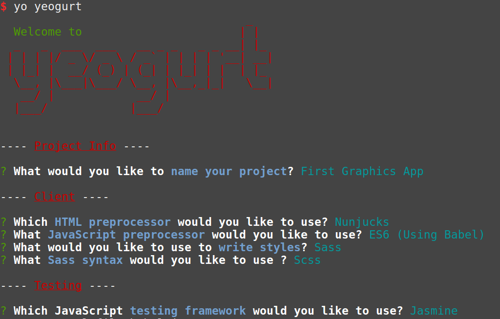

1. Your project name should be the slug "first-graphics-app"
2. The HTML preprocessor you choose must be "Nunjucks."
3. The JavaScript preprocessor your choose must be "ES6 (Using Babel)"
4. Styles must be written with "Sass"
5. The Sass syntax must be "Scss"

Don't sweat the rest. But make sure you get the above right.

Yeoman will then use the generator to create a complete project that's ready for us to work in. Fire up its test server to see what it has to offer out of the box.

.. code-block:: bash

    $ gulp serve

Visit `localhost:3000 <http://localhost:3000>`_ in your browser. There you can see the generic website offered as a starting point by our Yeoman generator.

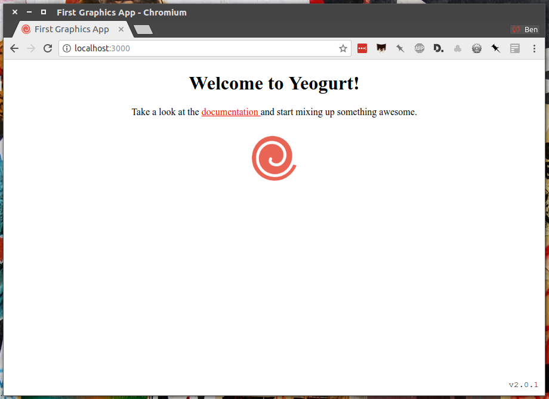

Congratulations, you've got your framework up and running. Let's save our work and then we'll be ready to start developing our own content.

.. note::

    While some frameworks are more popular than others, each newsroom tends to go its own way with a custom system for publishing pages. The programming languages and the details vary, but the fundamentals are almost all the same. Some of them have even been released as open-source software. They include:

    * The Los Angeles Times Data Desk's `bigbuild <https://github.com/datadesk/django-bigbuild>`_
    * The Seattle Times' `newsapp-template <https://github.com/seattletimes/newsapp-template/>`_
    * The NPR Apps team's `dailygraphics <https://github.com/nprapps/dailygraphics>`_
    * Politico's `generator-politico-graphics  <https://github.com/The-Politico/generator-politico-graphics>`_

Open a second terminal (this way you can keep your server running) and navigate to your code folder.

.. code-block:: bash

    $ cd Code
    $ cd first-graphics-app

Commit our work.

.. code-block:: bash

    $ git add .
    $ git commit -m "Installed framework"

Push it to GitHub.

.. code-block:: bash

    $ git push origin master

*************************
Chapter 3: Hello template
*************************

Navigate back to `localhost:3000 <http://localhost:3000/>`_ in your browser. You should see the same default homepage as before.

Its contents is configured in the ``index.nunjucks`` file found in the directory Yeoman created. It uses a templating language for JavaScript invented at Mozilla called `Nunjucks <https://mozilla.github.io/nunjucks/>`_.

You can edit the page by changing what's found inside of the ``content`` block. Make a change and save the file.

.. code-block:: jinja
    :emphasize-lines: 2

    
    
Hello World

    

You should see it immediately show up thanks to a `BrowserSync <https://browsersync.io>`_, a popular feature of Gulp that automatically updates your test site after you make a change.

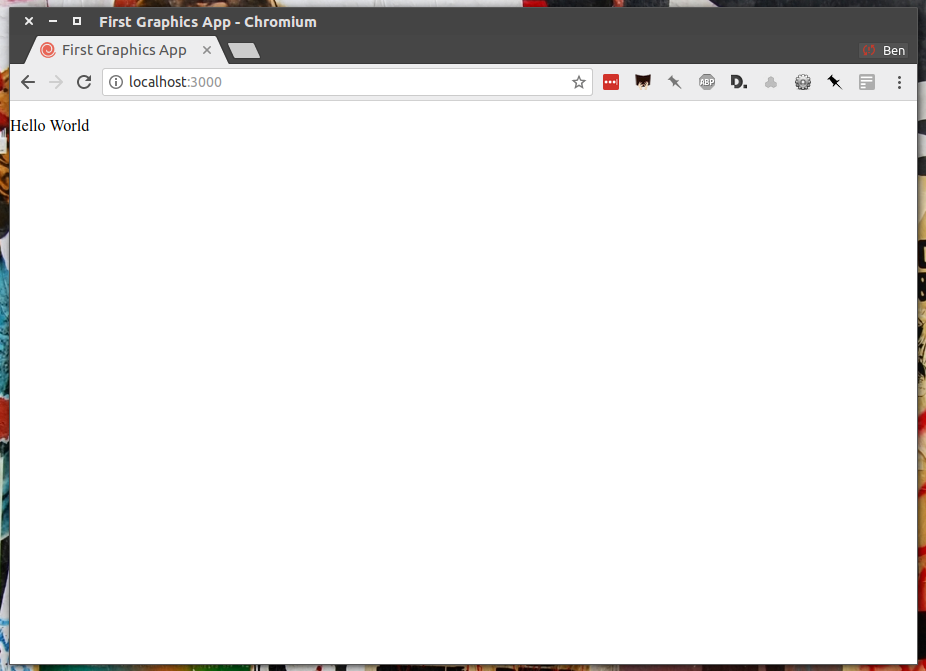

Look closely at the index file you and will notice that it doesn't include code for much of what you can see on the live page. For instance, you won't see the HTML of the navigation bar or the stylesheets that dicatate how the page looks.

That's because that boilerplate has been moved back into a parent template "extended" by the index file with a line of Nunjucks code at the top of the page.

.. code-block:: jinja

    

That "base" file, sometimes called the "layout," can be inherited by other pages on your site to avoid duplication and share common code. One change to a parent file instantly ripples out to all pages the extend it. This approach to "template inheritance" is not just found in Nunjucks. It can be found in other templating systems, including Python ones like `Django <https://docs.djangoproject.com/en/1.7/topics/templates/>`_ and `Jinja <http://jinja.pocoo.org>`_.

You can find the base layout packaged with our framework in the ``_layouts/base.nunjucks`` file. It includes a set of block tags, like ``content``, that act as placeholders for use in templates that extend it.

Make a small change above the block and save the file.

.. code-block:: jinja
    :emphasize-lines: 1

    Above content
    

You should see the change on our site, with the new line appearing above the paragraph we added earlier to the index file.

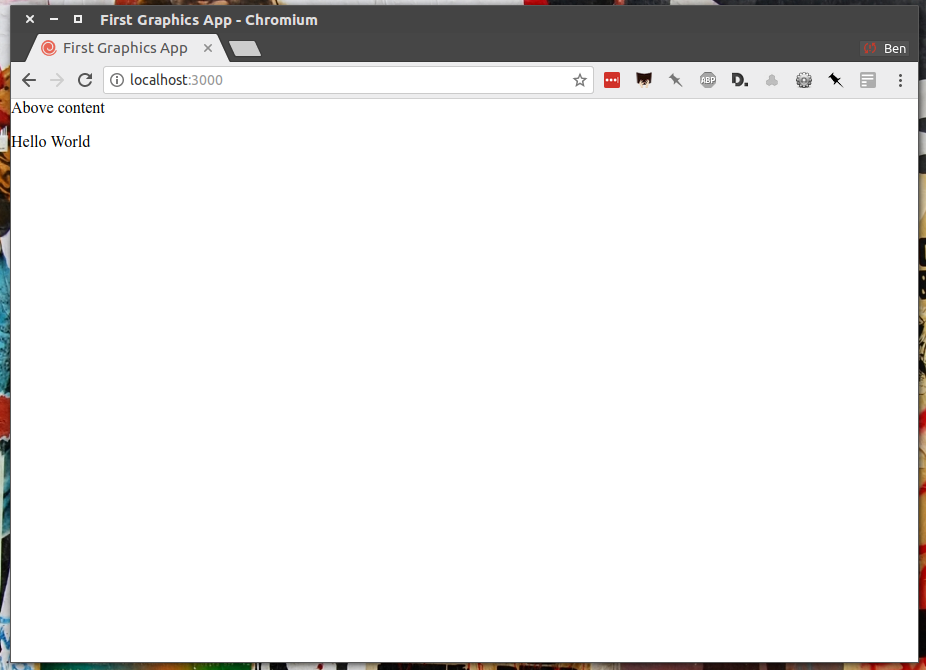

Most newsrooms that use a similar system have a own base template for all of their custom pages. Graphic artists and designers install and extend it as the first step in their work. They develop their custom page within its confines and largely accept the furniture it provides, like the site's header and footer, fonts, common color schemes. This allows them to work more quickly because they do not have to bother with reinventing their site's most common elements.

.. note::

    While most newsrooms keep their base templates to themselves, a few have published them as open-source software. You can find them online, if you know where to look. They include:

    * The Los Angeles Times Data Desk's `HTML Cookbook <http://cookbook.latimes.com>`_
    * The Texas Tribune News App team's `style guide <https://apps.texastribune.org/styles/>`_
    * Politico's `style guide <https://github.com/The-Politico/politico-style>`_

For this class, we have developed a base template that will act as a proxy for a real newsroom's base template. It is not as sophisticated or complete as a real-world example, but it will provide all of the basic elements we will need for this class.

You can find it in the code block below. Copy all of its contents and paste them into ``_layouts/base.nunjucks``, replacing everything.

.. code-block:: jinja

    <!doctype html>
    <html lang="en">
    <head>
        <meta charset="utf-8">
        <meta name="viewport" content="width=device-width, initial-scale=1.0">
        <title>First Graphics App</title>
        <link rel="stylesheet" href="https://maxcdn.bootstrapcdn.com/bootstrap/4.0.0/css/bootstrap.min.css">
        <link rel="stylesheet" href="styles/main.css">
        <link rel="stylesheet" href="https://bl.ocks.org/palewire/raw/1035cd306a2f85b362b1a20ce315b8eb/base.css?rev=8">
        
    </head>
    <body>
        <nav>
            
        </nav>
        <header>
            <h1></h1>
            

                
            

            

                
            

        </header>
        
        
        
    </body>
    </html>

As you can see, it includes all of the standard HTML tags, with our custom stylesheets and content blocks mixed in.

To see the effects, return to ``index.nunjucks`` and fill in a headline using the ``headline`` block introduced by our base template. Save the page and you should quickly see it appear on the page.

.. code-block:: jinja
    :emphasize-lines: 3

    

    My headline will go here

.. image:: _static/headline.png
    :width: 100%

Now fill in a byline.

.. code-block:: jinja
    :emphasize-lines: 4

    

    My headline will go here
    By me

.. image:: _static/byline.png
    :width: 100%

And let's do the publication date too while we are at it.

.. code-block:: jinja
    :emphasize-lines: 5-7

    

    My headline will go here
    By me
    
        <time datetime="2018-03-10" pubdate>Mar. 10, 2018</time>
    

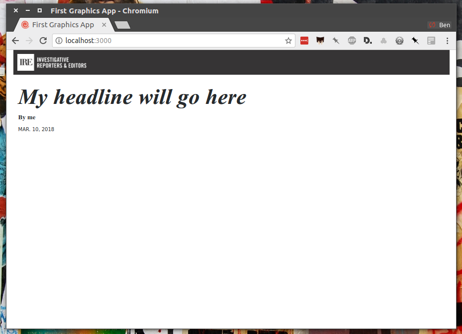

Congratulations, you've installed a base template and started in on creating your first custom page. Now is another good time to pause and commit our work.

.. code-block:: bash

    $ git add .
    # ☝️ A fun trick to add *all* of the pages you've changed with one command. ☝️
    $ git commit -m "Started editing templates"

And, again, push it to GitHub.

.. code-block:: bash

    $ git push origin master

.. note::

    You'll notice that the all of the sub folders in the ``src/`` directory of your project have underscores ``_`` in front of their name. This convention is used to note that these files are **private**, and won't be deployed.

    Instead, Gulp processes the contents of these folders when it builds the project and serves the files from a ``tmp/`` folder, where you'll see unprefixed ``images/``, ``scripts/`` and ``styles/`` directories.

*********************
Chapter 4: Hello data
*********************

Add the `Harvard Park homicides data files <https://raw.githubusercontent.com/ireapps/first-graphics-app/master/src/_data/harvard_park_homicides.json>`_ to ``_data/harvard_park_homicides.json``

It includes a list with a dictionary of data about each homicide victim in the neighborhood since 2000.

.. code-block:: javascript

    [
       {
          "case_number":"2017-04514",
          "slug":"eddie-rosendo-lino",
          "first_name":"Eddie",
          "middle_name":"Rosendo",
          "last_name":"Lino",
          "death_date":"2017-06-18T00:00:00.000Z",
          "death_year":2017,
          "age":23.0,
          "race":"black",
          "gender":"male",
          "image":null,
          "longitude":-118.304107484,
          "latitude":33.9904336958
       },
       {
          "case_number":"2017-03454",
          "slug":"alex-david-lomeli",
          "first_name":"Alex",
          "middle_name":"David",
          "last_name":"Lomeli",
          "death_date":"2017-05-07T00:00:00.000Z",
          "death_year":2017,
          "age":18.0,
          "race":"latino",
          "gender":"male",
          "image":null,
          "longitude":-118.300290584,
          "latitude":33.9793646958
       },
       ...

Return to ``index.nunjucks`` and add the following to the bottom to print the data out on the page.

.. code-block:: jinja

    
        {{ site.data.harvard_park_homicides }}
    

Here's what you should see.

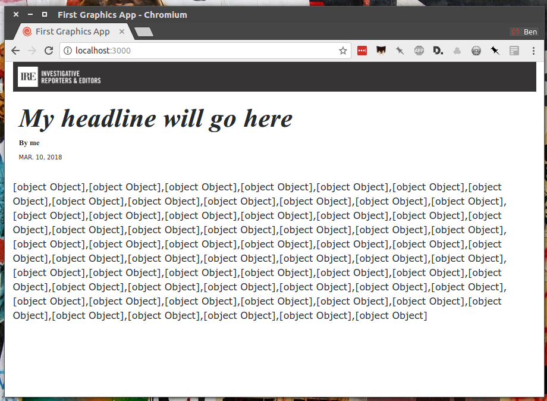

Loop through them and print them all.

.. code-block:: jinja

    
    
        {{ obj }}
    
    

Add a line break with a `` `` tag.

.. code-block:: jinja

    
    
        {{ obj }} 
    
    

.. image:: _static/hello-loop.png
    :width: 100%

Print the last name.

.. code-block:: jinja

    
    
        {{ obj.last_name }} 
    
    

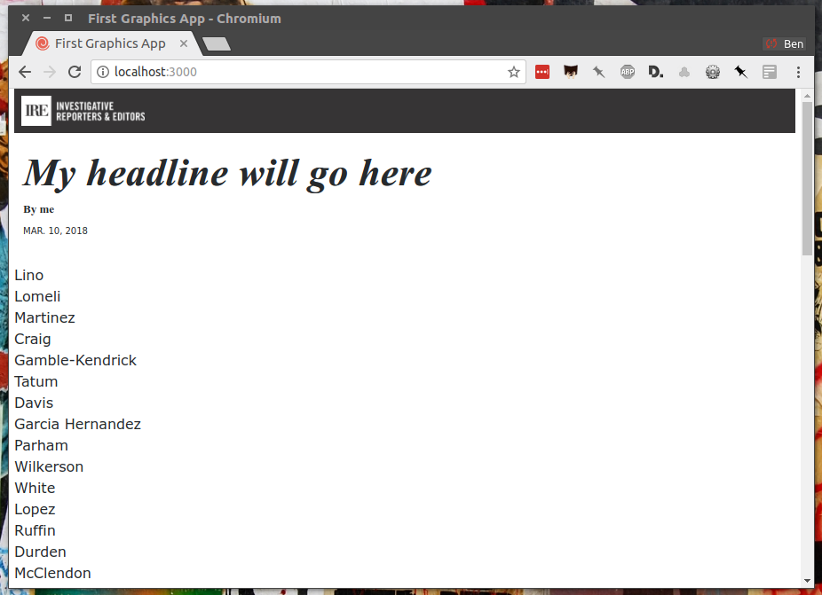

Add the first name. To have them display more nicely, you can also add a line break in between each one.

.. code-block:: jinja

    
    
        {{ obj.first_name }} {{ obj.last_name }} 
    
    

.. image:: _static/hello-full-name.png
    :width: 100%

Commit our work.

.. code-block:: bash

    $ git add .
    $ git commit -m "Printed a list of names from data"

Push it to GitHub.

.. code-block:: bash

    $ git push origin master

**********************
Chapter 5: Hello cards
**********************

YO
Explain Bootstrap. Show what we're trying to make.

.. image:: _static/bootstrap.png
    :width: 100%

Talk about cards. Show Bootstrap docs.

.. image:: _static/bootstrap-cols.png
    :width: 100%

Basic card with only a title. Talk about divs. etc.

.. code-block:: jinja

    
    
        

          

            <h5 class="card-title">{{ obj.first_name }} {{ obj.last_name }}</h5>
          

        

    
    

.. image:: _static/cards-first.png
    :width: 100%

Add a sentence below the title.

.. code-block:: jinja

    
        

          

            <h5 class="card-title">{{ obj.first_name }} {{ obj.last_name }}</h5>
            
A {{ obj.age}}-year-old {{ obj.race }} {{ obj.gender }} died in {{ obj.death_year }}.

          

        

    

PHOTO ONCE WE FINALIZE THE SENTENCE

Add an image.

.. code-block:: jinja

    
        

          
          

            <h5 class="card-title">{{ obj.first_name }} {{ obj.last_name }}</h5>
            
A {{ obj.age}}-year-old {{ obj.race }} {{ obj.gender }} died in {{ obj.death_year }}.

          

        

    

PHOTO ONCE WE FINALIZE THE SENTENCE

Add if clause around the image.

.. code-block:: jinja

    
        

          
          

            <h5 class="card-title">{{ obj.first_name }} {{ obj.last_name }}</h5>
            
A {{ obj.age}}-year-old {{ obj.race }} {{ obj.gender }} died in {{ obj.death_year }}.

          

        

    

PHOTO ONCE WE FINALIZE THE SENTENCE

Add the columns.

.. code-block:: jinja

    

        
        

          
          

            <h5 class="card-title">{{ obj.first_name }} {{ obj.last_name }}</h5>
            
A {{ obj.age}}-year-old {{ obj.race }} {{ obj.gender }} died in {{ obj.death_year }}.

          

        

        
    

PHOTO ONCE WE FINALIZE THE SENTENCE

Write a headline.

.. code-block:: jinja

    TK

PHOTO

Write the chatter.

.. code-block:: jinja

    TK

PHOTO

Section tag.

.. code-block:: jinja

    TK

PHOTO

***********************
Chapter 6: Hello charts
***********************

We have data, but what does it look like?

To visualize our data, we're going to use `plotly.js <https://plot.ly/javascript/>`_. Plotly.js is an open source library built on top of the popular `D3 <https://d3js.org/>`_ library, which powers a lot of the news graphics made with JavaScript you see online.

.. note::

    You've probably heard of the `D3 <https://d3js.org>`_, the data visualization library by Mike Bostock. Why aren't we using it? It's an incredibly powerful tool, but a little too complex for making simple bar charts on your first day writing JavaScript. Instead we're going to use a library that simplifies the tools provided by D3 into something that's easier to use.

First, use npm to install plotly.js.

.. code-block:: bash

    $ npm install -s plotly.js

The ``-s`` argument saves plotly to a dependencies file. That way, if you ever need to go through the install steps for your app again, you can do so easily.

From here, we'll be working in our ``_scripts`` folder. Create a file called ``_charts.js`` inside of ``_scripts/``.

You can include the libraries we installed (or any JavaScript file!) by using ``require()``. Plotly is a HUGE library, so we're only going to import the parts of it that we need.

.. code-block:: javascript

    var Plotly = require('plotly.js/lib/core');
    var Plotlybar = require('plotly.js/lib/bar');

    Plotly.register(Plotlybar);

    // At the end of the _charts.js file
    console.log('hello, this is my charts file!')

Remember our underscore coding convention? Here, ``_charts.js`` has an underscore (``_``) in front of it because it will be compiled into ``main.js`` when the site is baked.

That is, if we tell it to. Use the same ``require()`` method to pull our code into ``main.js``. Unlike ``_charts.js``, ``main.js`` doesn't have an underscore, because it is the file that the other scripts will be pulled into.

.. code-block:: javascript
    :emphasize-lines: 14

    // Main javascript entry point
    // Should handle bootstrapping/starting application

    'use strict';

    import $ from 'jquery';
    import Link from '../_modules/link/link';

    $(() => {
      new Link(); // Activate Link modules logic
      console.log('Welcome to Yeogurt!');
    });

    var chart = require('./_charts.js');

Structuring our code this way helps keep things organized, as each file controls one specific part of the page. Need to make an adjustment to your chart? Go to ``_charts.js``.

Now if you reload your page and go to your inspector (click on the three dots in the top right of Chrome, go down to "More tools" and select "Developer tools"), you should see ``hello, this is my charts file!`` in the console.

.. image:: _static/hello-charts.png
    :width: 100%

What chart should we make? The story points out that Harvard Park experienced an increase in homicides as there was a decrease across the rest of the county. Let's try to visualize that.

First, we need somewhere for our charts to go. In our ``index.nunjucks`` file, inside of ```` where you want the chart to go, create a ``div`` element with an id of ``county-homicides``, and another with an id of ``harvard-park-homicides``.

.. code-block:: html
    :emphasize-lines: 11-12

    

    My headline will go here
    By me
    
        <time datetime="2018-03-10" pubdate>Mar. 10, 2018</time>
    

    

    

    

    
    

        
        

          
          

            <h5 class="card-title">{{ obj.first_name }} {{ obj.last_name }}</h5>
            
A {{ obj.age}}-year-old {{ obj.race }} {{ obj.gender }} died in {{ obj.death_year }}.

          

        

        
    

    

    

Meanwhile, we need data. Copy the `annual totals data <https://raw.githubusercontent.com/ireapps/first-graphics-app/master/src/_data/annual_totals.json>`_ to ``_data/annual_totals.json``. We can use nunjucks to include our data file directly in the template.

Add a ```` block to the end of your ``index.nunjucks`` file:

.. code-block:: html

    
    
    

Making a chart in Plotly is simple, but we have to do some data transformation first. Plotly wants the x and y values of the chart to be in arrays, which are like a list of values. Meanwhle, if you look in ``_data/annual_totals.json``, you'll see that the data is structured in JavaScript objects, like this:

.. code-block:: javascript

    {
       "year":2000,
       "homicides_total":1036,
       "homicides_harvard_park":3
    },
    {
       "year":2001,
       "homicides_total":1125,
       "homicides_harvard_park":2
    },
    ...

We want to make two charts - one of county homicides and one of killings in Harvard Park. So let's make arrays that will hold those values that we will then provide to our function, as well as the years. We can use a little bit of JavaScript shorthand for this, using the ``.map()`` method and "arrow" functions.

.. code-block:: javascript
    :emphasize-lines: 6-9

    var Plotly = require('plotly.js/lib/core');
    var Plotlybar = require('plotly.js/lib/bar');

    Plotly.register(Plotlybar);

    // Initialize the arrays that will hold our lists of data
    var countyHomicides = annualTotals.map(a => a.homicides_total);
    var harvardParkHomicides = annualTotals.map(a => a.homicides_harvard_park);
    var years = annualTotals.map(a => a.year);

The ``.map()`` creates and returns an array, and the arrow (``=>``) function returns the value for each object. Think of it as "plucking" the values we want to form a list.

Now that we've populated our data, we're ready to make our chart. Right now, it's pretty simple, with a single variable ``settings`` providing options for the x axis, which we want to be our ``years`` array, and y axis, which is our homicide counts, and specifying the type of the chart.

Below ``settings`` we call ``Plotly.newPlot()`` with the id of the element where we want the chart to go and settings to create the chart.

.. code-block:: javascript

    // The rest of your code is up here.
    // Add the below lines to the bottom of your file

    // Use our x and y arrays for the values of the chart
    var settings = [{
        x: years,
        y: countyHomicides,
        type: 'bar'
    }];

    // Create the chart
    Plotly.newPlot('county-homicides', settings);

You should see something like this on your page.

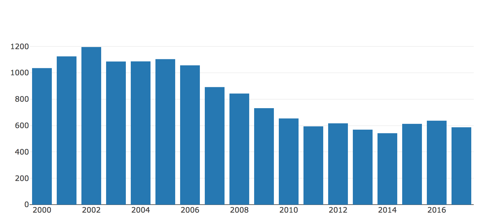

This is a good start, but we can further customize this chart so it fits better with the rest of the page. Now, let's try to:

- Add axis labels
- Change the colors of the bars
- Give the charts titles
- Display the two charts alongside one another

Let's add labels to our axes. Create a new variable, ``layout``. Here, we can specify display properties for ``xaxis`` and ``yaxis``. We don't have a homicide label on the Y axis because we'll add a title to the charts later that will take care of that.

.. code-block:: javascript

    var layout = {
        xaxis: {
            title: 'Year',
            fixedrange: true
        },
        yaxis: {
            fixedrange: true
        }
    };

The option ``fixedrange`` prevents clicking to zoom in on the chart, which I find mildly annoying.

Then, add ``layout`` as a third argument to ``Plotly.newPlot()``

.. code-block:: javascript

    Plotly.newPlot('county-homicides', settings, layout);

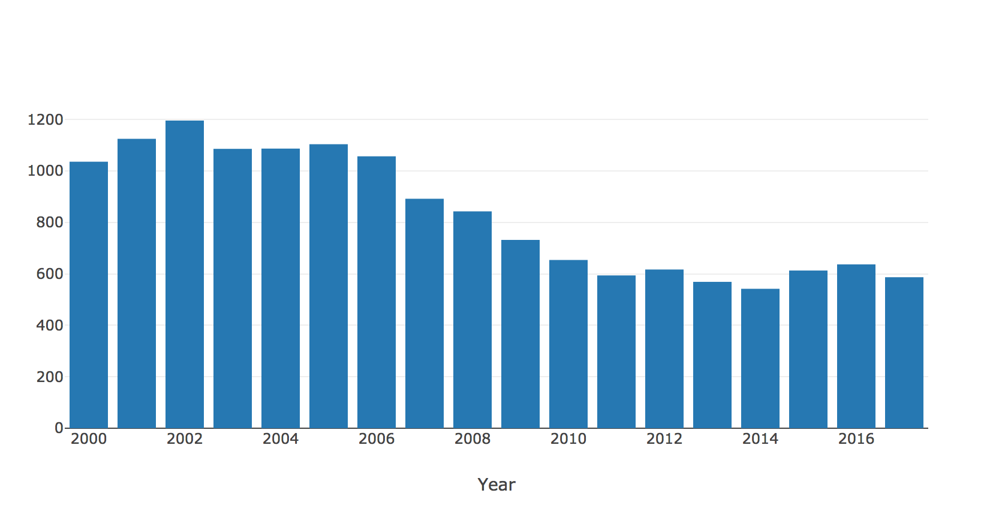

Everything in plotly.js is handled by settings like this. For example, to change the markers to an light blue, update the ``settings`` variable.

.. code-block:: javascript
    :emphasize-lines: 5-8

    var settings = [{
      x: years,
      y: countyHomicides,
      type: 'bar',
      // Add the new settings for marker here
      marker: {
        color: '#86c7df'
      }
    }];

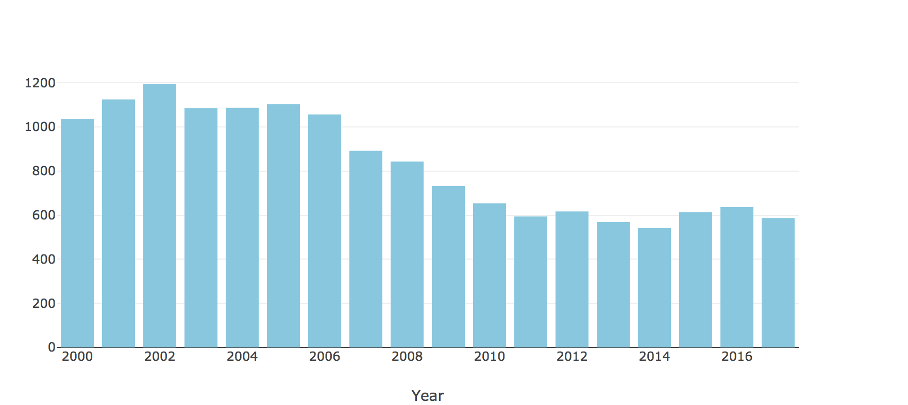

But wait, what if you want to make another chart? You'd have to copy and paste all that code over again.

Before we get to far, let's abstract all of this into a function.

.. code-block:: javascript

    function createChart(x, y, element) {
        // The code that creates our chart will go here.
    }

This is the start of a function that will take values for the x and y axes, and an HTML element, and create a chart with the data inside the element.

Now copy and paste the ``settings``, ``layout`` and the call to ``Plotly.newPlot()`` into the createChart function. Change the variables ``years`` and ``countyHomicides`` to ``x`` and ``y``.

Note also that we change ``'county-homicides'`` to ``element`` in the call to ``Plotly.newPlot()``.

.. code-block:: javascript
    :emphasize-lines: 4,5,23

    function createChart(x, y, element) {
        // The code that creates our chart will go here.
        var settings = [{
          x: x,
          y: y,
          type: 'bar',
          marker: {
            color: '#86c7df'
          }
        }];

        var layout = {
          xaxis: {
            title: 'Year',
            fixedrange: true
          },
          yaxis: {
            fixedrange: true
          }
        };

        // Create the chart
        Plotly.newPlot(element, settings, layout);
    }

Now, if you reload the page, you won't see your chart anymore! That's because we've defined the function, but we haven't called it.

To call the function, add this line to the end of your file.

.. code-block:: javascript

    // The rest of your code is up here
    createChart(years, countyHomicides, 'county-homicides');

Now, we can make a second chart by using the Harvard Park data. Be sure to replace the ID of the element you're building the chart in.

.. code-block:: javascript

    // The rest of your code is up here
    createChart(years, harvardParkHomicides, 'harvard-park-homicides');

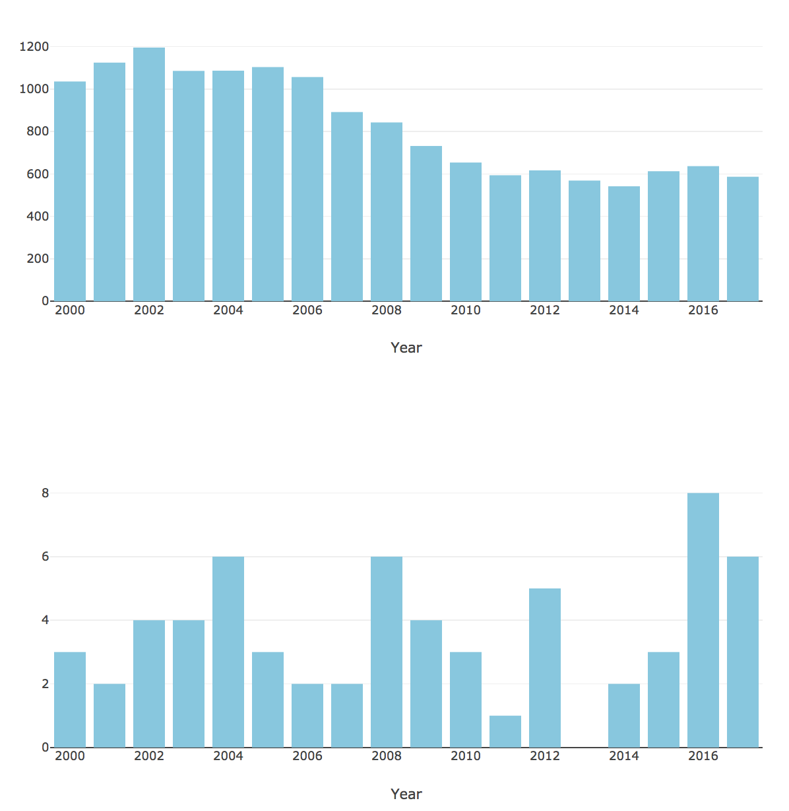

Not bad, right? By structuring our code this way, we'll be able to make multiple charts without repeating our code (known as `DRY <https://en.wikipedia.org/wiki/Don%27t_repeat_yourself>`_).

Right now, our charts are stacked on top of each other, which isn't really a great layout. We can use HTML and CSS to lay out our charts side-by-side.

In ``index.nunjucks``, add a ``div`` element with a class of ``charts-holder`` and ``clearfix`` that wraps your charts, and add a ``class`` of ``inline-chart`` to each of your charts.

Make sure you give the wrapping div a class of ``clearfix``, which will make sure that the rest of the page displays below these items.

.. code-block:: html

    

        

        

    

This gives us a structure that we can style with CSS. In the ``_scripts`` folder, create a file called ``_charts.scss``. In that file, copy or write the following:

.. code-block:: css

    .inline-chart {
        width: 49%;
        float: left;
    }

You won't see anything yet, because we haven't imported it into our main stylesheet. Use ``@import`` to bring your CSS file into ``main.css``

.. code-block:: css
    :emphasize-lines: 6

    // Normalize Styles
    @import 'node_modules/normalize.css/normalize';

    // Import Modules
    @import '../_modules/link/link';
    @import '_charts.scss';

Again, this is the same modular structure that allows us to organize our chart styles in a different place from our map styles, for example.

Reload the page to see your changes.

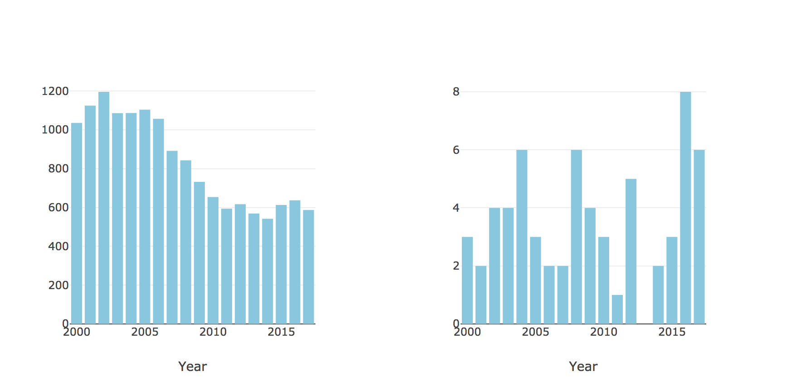

The charts are laid out side-by-side like we want them, but there's way too much space in between them. Luckily, we can adjust the margins in the chart layout. Back in ``_scripts/charts.js``, the following settings should work.

``l``, ``r``, ``t`` and ``b`` stand for left, right, top and bottom margins, respectively. Make sure you add a comma after the ``yaxis`` value!

.. code-block:: javascript
    :emphasize-lines: 8-16

    var layout = {
        xaxis: {
            title: 'Year',
            fixedrange: true
        },
        yaxis: {
            fixedrange: true
        },
        // Add the margin here
        // Don't forget the comma above!
        margin: {
            l: 30,
            r: 15,
            t: 45,
            b: 30
        }
    };

We can also add a parameter to reduce the height, they're a bit tall.

.. code-block:: javascript
    :emphasize-lines: 16-17

    var chartLayout = {
        xaxis: {
            title: 'Year',
            fixedrange: true
        },
        yaxis: {
            fixedrange: true
        },
        // Add the margin here
        margin: {
            l: 45,
            r: 15,
            t: 45,
            b: 30
        },
        // Add a height parameter to the bottom of your file
        height: 250
    };

Another nice modification - we can make the annoying toolbar go away by adjusting our call to ``Plotly.newPlot()``

.. code-block:: javascript

    Plotly.newPlot(element, settings, layout, {displayModeBar: false});

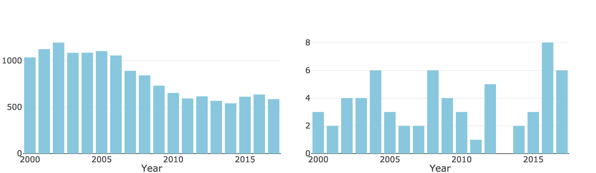

Much better! There are a couple more customization options we can do with plotly. While it's useful to get the homicide numbers on hover, we don't really need those year label popups. We can turn those off by only displaying hovers for y-axis values.

.. code-block:: javascript
    :emphasize-lines: 9-10

    function createChart(x, y, element) {
      var settings = [{
        x: x,
        y: y,
        type: 'bar',
        marker: {
          color: '#86c7df'
        },
        // Add this to your chart settings
        hoverinfo: 'y'
      }];

      // the rest of your code is down here
      ...
    }

You can also slightly customize the label. For example, let's change the background color.

.. code-block:: javascript
    :emphasize-lines: 11-13

    function createChart(x, y, element) {
      var settings = [{
        x: x,
        y: y,
        type: 'bar',
        marker: {
          color: '#86c7df'
        },
        // Add this to your chart settings
        hoverinfo: 'y',
        hoverlabel: {
          bgcolor: '#777777'
        }
      }];

      // the rest of your code is down here
      ...
    }

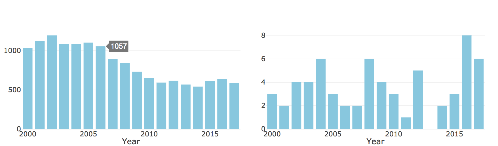

Last, our charts need titles! Since we want each chart to have a different title, we'll need to update our function a bit.

We're going to
 - add an argument to our ``createChart`` function for the title,
 - send that title to our chart options,
 - update our calls to provide that title

.. code-block:: javascript
    :emphasize-lines: 2,8

    // Note the new 'title' argument
    function createChart(x, y, element, title) {
        // More of the function is up here
        ...

        // Add a 'title' parameter to the layout properties
        var layout = {
          title: title,
          xaxis: {
            title: 'Year',
            fixedrange: true
          },
          yaxis: {
            fixedrange: true
          },
          // Add the margin here
          margin: {
            l: 30,
            r: 15,
            t: 45,
            b: 30
          },
          height: 250
        };

        // Create the chart
        Plotly.newPlot(element, settings, layout, {displayModeBar: false});
    }

Then, add the title you want to your function call. We'll assign them to variables first for cleanliness.

.. code-block:: javascript

    var countyChartTitle = "County Homicides, 2000-2017";
    var hpChartTitle = "Harvard Park Homicides, 2000-2017";

    createChart(years, countyHomicides, 'county-homicides', countyChartTitle);
    createChart(years, harvardParkHomicides, 'harvard-park-homicides', hpChartTitle);

These titles are a little light and blend in to the rest of the text. Let's make them bolder. The easiest way I've found to do this with Plotly is by wrapping them in bold tags.

.. code-block:: javascript
    :emphasize-lines: 1,2

    var countyChartTitle = "<b>County Homicides, 2000-2017</b>";
    var hpChartTitle = "<b>Harvard Park Homicides, 2000-2017</b>";

    createChart(years, countyHomicides, 'county-homicides', countyChartTitle);
    createChart(years, harvardParkHomicides, 'harvard-park-homicides', hpChartTitle);

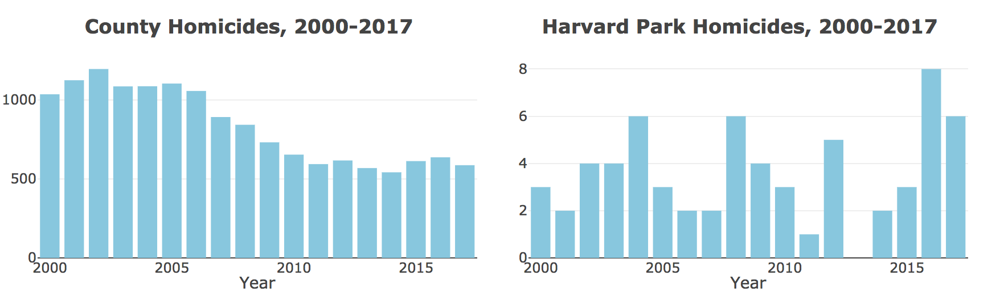

Congratulations, you've made your charts! Let's move on to our next challenge.

.. note::

    We used Plotly.js in this class, but there are many other JavaScript charting libraries, each one slightly different. If you want to explore this on your own, here are some other options that we considered using for this class

    - `Vega-lite <https://vega.github.io/vega-lite/>`_
    - `Charts.js <http://www.chartjs.org/>`_
    - `C3.js <http://c3js.org/>`_ Important to note that this does not seem to support the latest versions of D3.
    - `D3.js <https://d3js.org/>`_ The granddaddy of them all.

    There are also tools that allow you to use a visual editor, creating charts and other visualizations that you can download and/or embed in your project.

    - `Chartbuilder <https://quartz.github.io/Chartbuilder/>`_ from `Quartz <https://qz.com/>`_, is very good for basic, fast charts with light customization.
    - `DataWrapper <https://www.datawrapper.de/>`_ allows a range of visualizations beyond basic charts, including scatter plots and maps.

********************
Chapter 7: Hello map
********************

Next we'll move on to creating a map focused on West 62nd Street and Harvard Boulevard, an intersection in South Los Angeles where four men died in less than a year and a half.

To draw the map we will rely on `Leaflet <http://leafletjs.com>`_, a JavaScript library for creating interactive maps. We will install it just as before by using ``npm`` from our terminal.

.. code-block:: base

    $ npm install -s leaflet

After it's been installed, we should import Leaflet into ``_scripts/main.js`` so that its tools are available on our site.

.. code-block:: javascript
    :emphasize-lines: 15

    // Main javascript entry point
    // Should handle bootstrapping/starting application

    'use strict';

    var $ = require('jquery');
    var Link = require('../_modules/link/link');

    $(function() {
      new Link(); // Activate Link modules logic
      console.log('Welcome to Yeogurt!');
    });

    var chart = require('./charts.js');
    var L = require("leaflet");

We'll also need to add a little hack to the file so that Leaflet's images will load. Don't ask. It's a long story.

.. code-block:: javascript
    :emphasize-lines: 17

    // Main javascript entry point
    // Should handle bootstrapping/starting application

    'use strict';

    var $ = require('jquery');
    var Link = require('../_modules/link/link');

    $(function() {
      new Link(); // Activate Link modules logic
      console.log('Welcome to Yeogurt!');
    });

    var chart = require('./charts.js');
    var L = require("leaflet");

    L.Icon.Default.imagePath = 'https://unpkg.com/leaflet@1.3.1/dist/images/';

Next we import Leaflet's stylesheets in ``_styles/main.scss`` so that they are also included on our site.

.. code-block:: css
    :emphasize-lines: 7

    // Normalize Styles
    @import 'node_modules/normalize.css/normalize';

    // Import Modules
    @import '../_modules/link/link';
    @import '_charts.scss';
    @import 'node_modules/leaflet/dist/leaflet';

Now, back in the ``index.nunjucks`` template, we should create a placeholder in the page template where the map will live.

.. code-block:: jinja

    

To bring the map to life, add a new file named ``_map.js`` to the ``_scripts`` directory. Import it in ``main.js``.

.. code-block:: javascript
    :emphasize-lines: 16

    // Main javascript entry point
    // Should handle bootstrapping/starting application

    'use strict';

    var $ = require('jquery');
    var Link = require('../_modules/link/link');

    $(function() {
      new Link(); // Activate Link modules logic
      console.log('Welcome to Yeogurt!');
    });

    var chart = require('./charts.js');
    var L = require("leaflet");
    var map = require("./_map.js");

    L.Icon.Default.imagePath = 'https://unpkg.com/leaflet@1.3.1/dist/images/';

Now in ``_scripts/_map.js`` paste in the following Leaflet code to generate a simple map. It does three things: create a new map in the HTML element we made with "map" set as its ID; add a new map layer with roads, borders, water and other features from OpenStreetMap; finally, add the layer to the map.

.. code-block:: javascript

    var map = L.map('map');
    var osm = L.tileLayer('http://{s}.tile.openstreetmap.org/{z}/{x}/{y}.png');
    osm.addTo(map);

After you save, the index page should reload with a blank map.

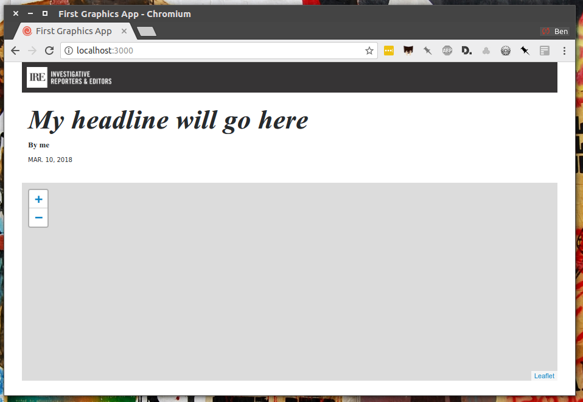

To zero in on the area we're reporting on, we will need its longitude and latitude coordinates. Go to Google Maps and find 62nd Street and Harvard Boulevard in South LA. Hold down a click until it gives you the coordinates in a popup box. Paste those numbers into Leaflet's ``setView`` method with a zoom level of 15 included.

.. code-block:: javascript
    :emphasize-lines: 4

    var map = L.map('map')
    var osm = L.tileLayer('http://{s}.tile.openstreetmap.org/{z}/{x}/{y}.png');
    osm.addTo(map);
    map.setView([33.983265, -118.306799], 15);

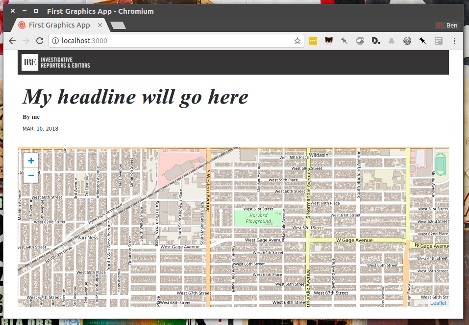

After you save the file, your map should have relocated. Let's tighten up that zoom and save again.

.. code-block:: javascript
    :emphasize-lines: 4

    var map = L.map('map')
    var osm = L.tileLayer('http://{s}.tile.openstreetmap.org/{z}/{x}/{y}.png');
    osm.addTo(map);
    map.setView([33.983265, -118.306799], 18);

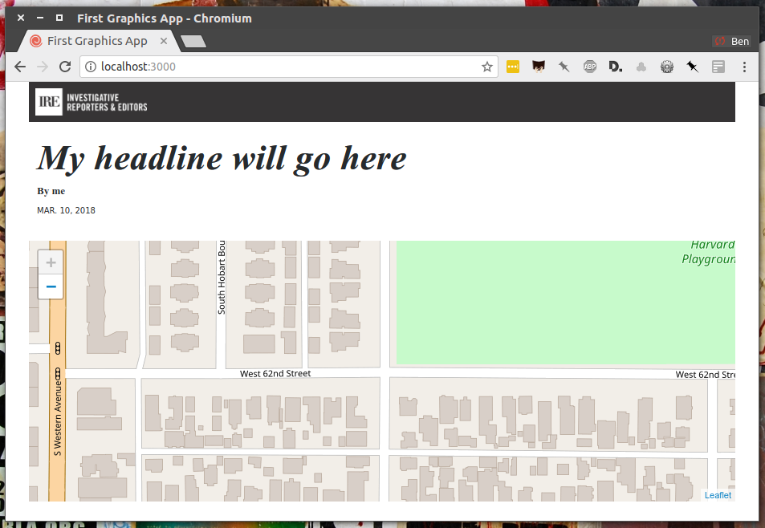

Now let's load some data on the map. We will return to the list of all homicides already stored in ``_data/harvard_park_homicides.json``.

Open ``index.nunjucks`` and add a new variable to the ``scripts`` block where the homicides list is stored.

.. code-block:: jinja
    :emphasize-lines: 4

    
    
    

Now return to ``_scripts/_map.js``. At the bottom add some JavaScript code that steps through the homicide list and adds each one to the map as a circle, just like the real Homicide Report.

.. code-block:: javascript
    :emphasize-lines: 6-9

    var map = L.map('map')
    var osm = L.tileLayer('http://{s}.tile.openstreetmap.org/{z}/{x}/{y}.png');
    osm.addTo(map);
    map.setView([33.983265, -118.306799], 18);

    homicides.forEach(function (obj) {
        L.circleMarker([obj.latitude,  obj.longitude])
          .addTo(map);
    });

Save the file and you should now see all the homicides mapped on the page.

Next, extend the code in ``_scripts/_map.js`` to add a tooltip label on each point.

.. code-block:: javascript
    :emphasize-lines: 4

    homicides.forEach(function (obj) {
        L.circleMarker([obj.latitude,  obj.longitude])
          .addTo(map)
          .bindTooltip(obj.first_name + " " + obj.last_name);
    })

Here's what you should see after you do that.

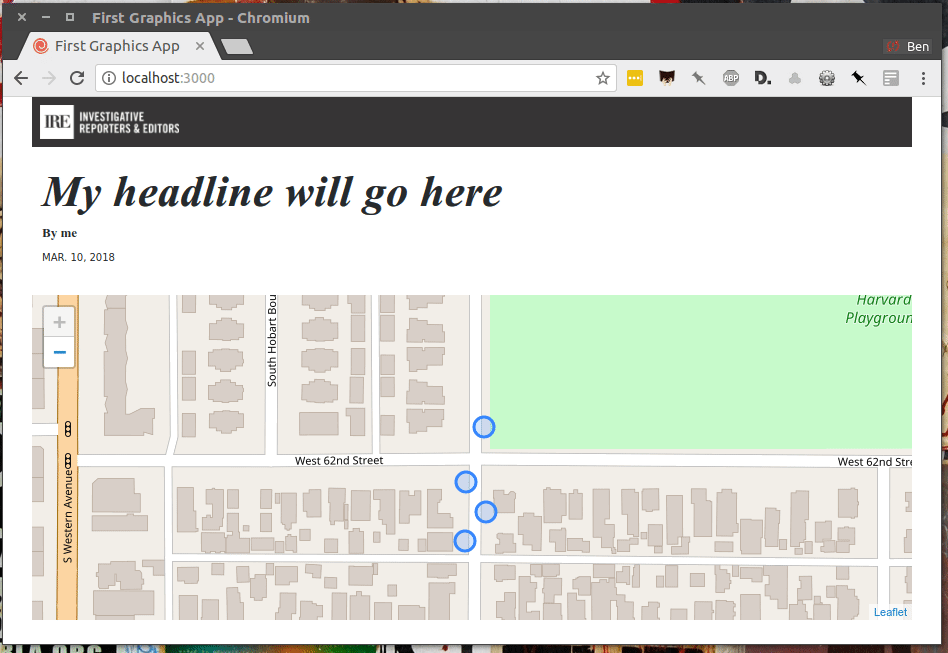

Next let's sprinkle some CSS in our page to make the circles match the orange color of the dots found on The Homicide Report. As we did with the charts, go to the ``_scripts`` folder and create a new file. We'll call this one ``_map.scss``. In that file, copy or write the following:

.. code-block:: css

    path {
        fill: #e64d1f;
        fill-opacity: 0.5;
        stroke-opacity: 0;
    }

Just as before, that won't change anything until you import our new file into the main stylesheet. Again, use ``@import`` to introduce your CSS file into ``main.css``

.. code-block:: css
    :emphasize-lines: 8

    // Normalize Styles
    @import 'node_modules/normalize.css/normalize';

    // Import Modules
    @import '../_modules/link/link';
    @import '_charts.scss';
    @import 'node_modules/leaflet/dist/leaflet';
    @import '_map.scss';

After you save, here's what you'll get.

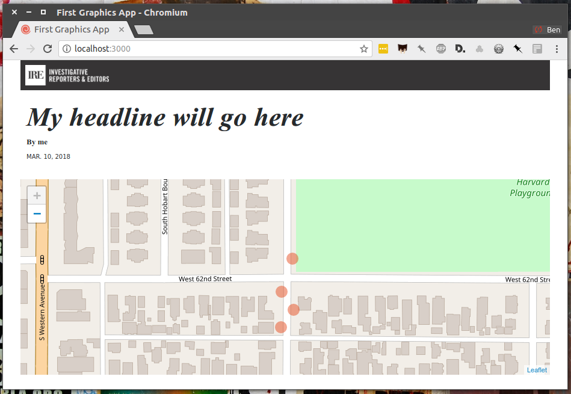

To make the tooltips visible all the time, edit the JavaScript in ``_scripts/_map.js`` to make the tooltips "permanent."

.. code-block:: javascript
    :emphasize-lines: 4

    homicides.forEach(function (obj) {
        L.circleMarker([obj.latitude,  obj.longitude])
          .addTo(map)
          .bindTooltip(obj.first_name + " " + obj.last_name, {permanent: true});
    });

Here they are.

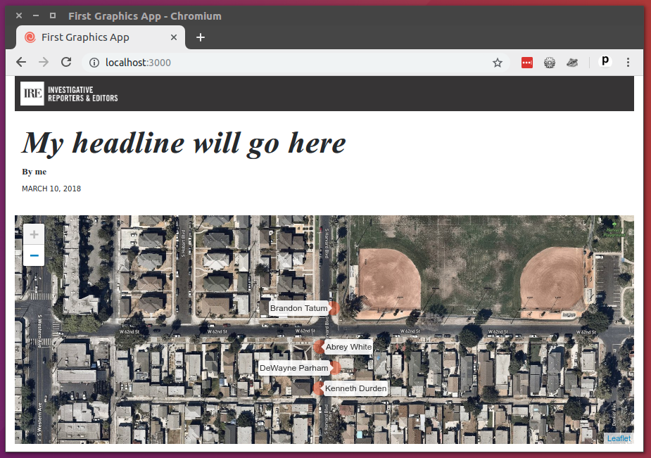

Alright. We've got an okay map. But it's zoomed in so close a reader might now know where it is. To combat this problem, graphic artists often inset a small map in the corner that shows the the area of focus from a greater distance.

Lucky for us, there's already a Leaflet extension that provides this feature. It's called `MiniMap <https://github.com/Norkart/Leaflet-MiniMap>`_.

To put it to use, we'll need to return to our friend ``npm``.

.. code-block:: bash

    $ npm install -s leaflet-minimap

Just as with other libraries, we need to import it into `_scripts/main.js`.

.. code-block:: javascript
    :emphasize-lines: 16

    // Main javascript entry point
    // Should handle bootstrapping/starting application

    'use strict';

    var $ = require('jquery');
    var Link = require('../_modules/link/link');

    $(function() {
      new Link(); // Activate Link modules logic
      console.log('Welcome to Yeogurt!');
    });

    var chart = require('./charts.js');
    var L = require("leaflet");
    var MiniMap = require('leaflet-minimap');
    var map = require("./_map.js");

    L.Icon.Default.imagePath = 'https://unpkg.com/leaflet@1.3.1/dist/images/';

Its stylesheets also need to be imported to ``_styles/main.scss``.

.. code-block:: css
    :emphasize-lines: 8

    // Normalize Styles
    @import 'node_modules/normalize.css/normalize';

    // Import Modules
    @import '../_modules/link/link';
    @import '_charts.scss';
    @import 'node_modules/leaflet/dist/leaflet';
    @import 'node_modules/leaflet-minimap/src/Control.MiniMap';
    @import '_map.scss';

Now that everything is installed, return to ``scripts/_map.js`` and create an inset map with the library's custom tools. We can set its view with the ``maxZoom`` option.

.. code-block:: javascript
    :emphasize-lines: 12-16

    var map = L.map('map')
    var osm = L.tileLayer('http://{s}.tile.openstreetmap.org/{z}/{x}/{y}.png');
    osm.addTo(map);
    map.setView([33.983265, -118.306799], 18);

    homicides.forEach(function (obj) {
        L.circleMarker([obj.latitude,  obj.longitude])
          .addTo(map)
          .bindTooltip(obj.first_name + " " + obj.last_name, {permanent: true});
    })

    var osm2 = L.tileLayer('http://{s}.tile.openstreetmap.org/{z}/{x}/{y}.png', {
        maxZoom: 9
    });
    var mini = new L.Control.MiniMap(osm2, { toggleDisplay: true });
    mini.addTo(map);

Save the file and the inset map should appear on your page.

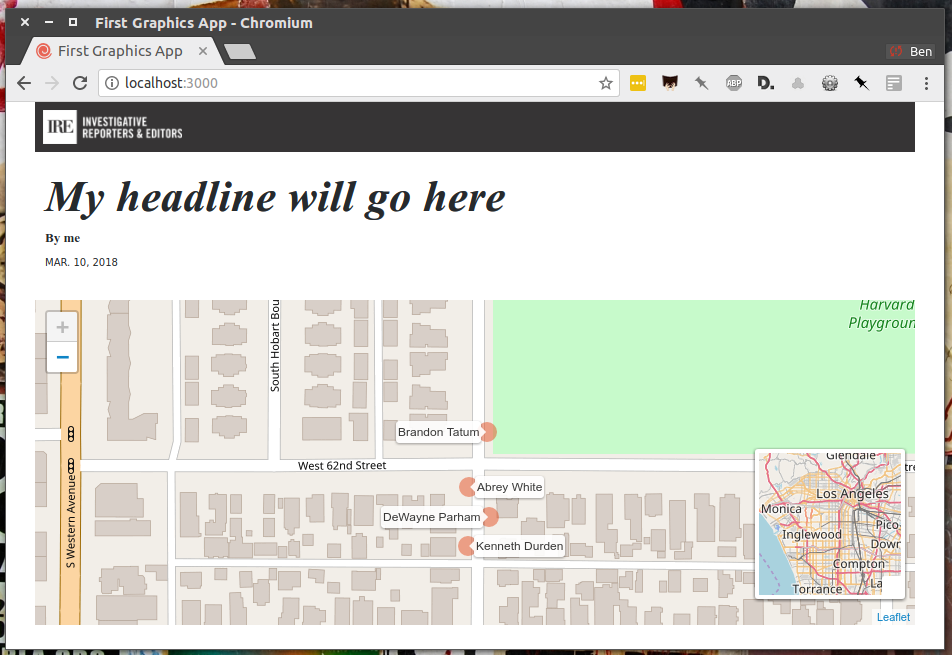

Finally, let's preface the map with so a headline.

.. code-block:: html

    <h3>One corner. Four killings</h3>
    

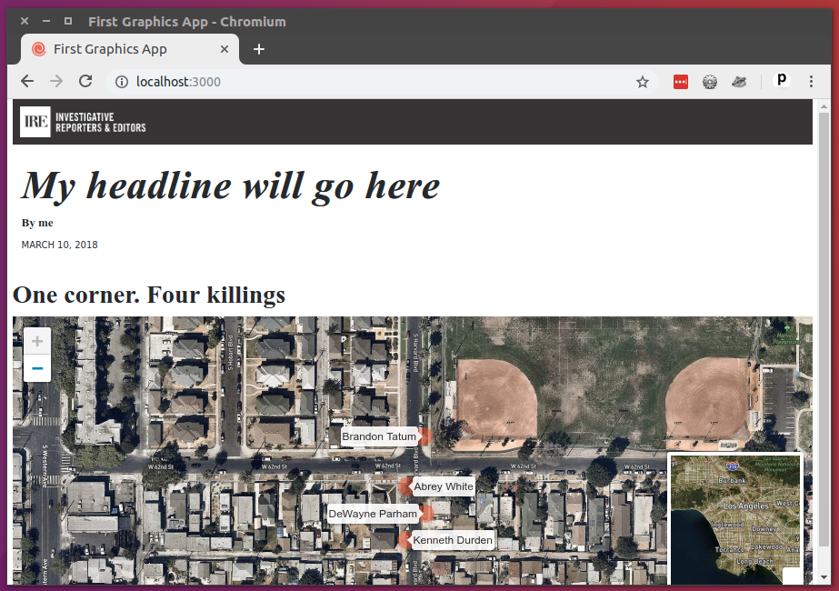

Then an introductory paragraph.

.. code-block:: html

    <h3>One corner. Four killings</h3>
    
The southwest corner of Harvard Park, at West 62nd Street and Harvard Boulevard, has been especially deadly. In the last year-and-a-half, four men have been killed there — while sitting in a car, trying to defuse an argument or walking home from the barber shop or the corner store.

    

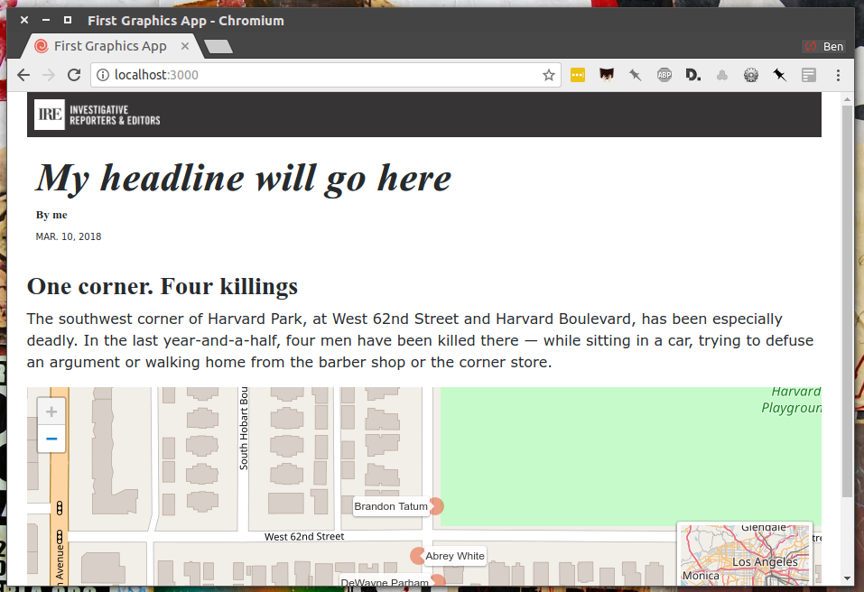

All wrapped up in a ``<section>`` tag.

.. code-block:: html

    <section>
        <h3>One corner. Four killings</h3>
        
The southwest corner of Harvard Park, at West 62nd Street and Harvard Boulevard, has been especially deadly. In the last year-and-a-half, four men have been killed there — while sitting in a car, trying to defuse an argument or walking home from the barber shop or the corner store.

        

    </section>

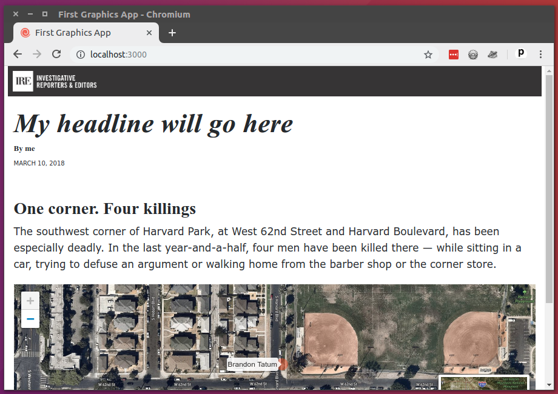

Congratulations. You've created a custom map. Before we get on to the business of sharing it with the world, we need a couple more pieces here.

Hey. How about a headline?

.. code-block:: html
    :emphasize-lines: 3

    

    A South L.A. neighborhood grapples with a wave of violence
    By me
    
        <time datetime="2018-03-10" pubdate>Mar. 10, 2018</time>
    

.. image:: _static/final-headline.png
    :width: 100%

And a real byline.

.. code-block:: html
    :emphasize-lines: 4

    

    A South L.A. neighborhood grapples with a wave of violence
    By <a href="http://www.firstgraphicsapp.org/">The First Graphics App Tutorial</a>
    
        <time datetime="2018-03-10" pubdate>Mar. 10, 2018</time>
    

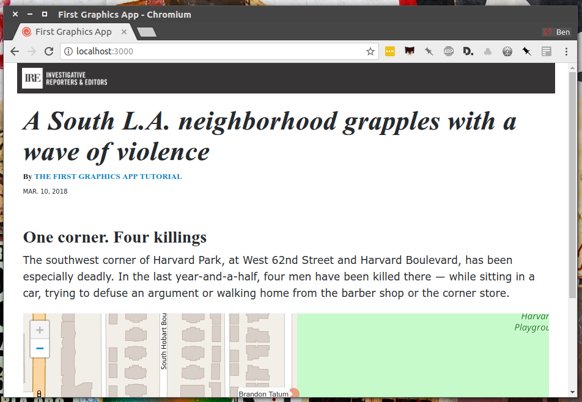

And let's a write a lead.

.. code-block:: html
    :emphasize-lines: 1-3

    
    <section>
        
The area around Harvard Park was the deadliest place for African Americans in Los Angeles County last year, according to <a href="http://homicide.latimes.com/">The Times’ Homicide Report</a>. So far this year, six people have been killed. Most of the victims were black men.
 </section>
    <section>
    <h3>One corner. Four killings</h3>
    
The southwest corner of Harvard Park, at West 62nd Street and Harvard Boulevard, has been especially deadly. In the last year-and-a-half, four men have been killed there — while sitting in a car, trying to defuse an argument or walking home from the barber shop or the corner store.

    

    </section>
    ...
    

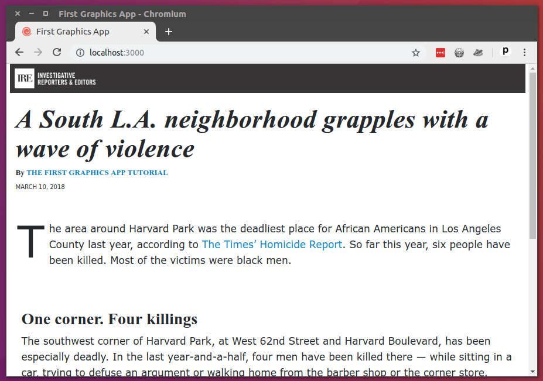

Now we're ready. Let's do it live.

*************************
Chapter 8: Hello Internet
*************************

In in our last chapter, all the work we've done will finally be published online.

Our Yeoman framework, with its tools, structure and shortcuts, has served us well. It's been a great place to experiment, organize and develop our work. But it's useless to our readers.

The HTML, JavaScript and CSS files the framework generates are all they need. Without all the code running our terminal, those files aren't be able to take advantage of Yeogurt, Gulp, BrowserSync and all our other tricks. But it won't matter. We can upload the simple files our framework renders to the web and they'll be enough for anyone who wants them.

That process — converting a dynamic, living website to simple files living on the filesystem — is a common strategy for publishing news sites. It goes by different names, like "flattening," "freezing" or "baking."  Whatever you call it, it’s a solid path to cheap­, stable host­ing for simple sites. It is used across the industry for pub­lish­ing elec­tion res­ults, longform stories, spe­cial pro­jects and numerous other things.

.. note::

    Examples of static news pages in the wild include:

    * `A wide array of interactive graphics <https://www.washingtonpost.com/graphics/2017/ns/year-in-graphics/>`_ by The Washington Post
    * Hundreds of Los Angeles Times stories at `latimes.com/projects <http://www.latimes.com/projects/>`_
    * Dozens more from The Seattle Times at `projects.seattletimes.com <https://projects.seattletimes.com>`_
    * Interactive apps by `The Dallas Morning News <https://interactives.dallasnews.com/2018/secrets-dallas-dead/>`_
    * `Live election results <https://open.blogs.nytimes.com/2010/12/20/using-flat-files-so-elections-dont-break-your-server/>`_ published by The New York Times
    * Data downloads from the `California Civic Data Coalition <https://calaccess.californiacivicdata.org/downloads/latest/>`_

Lucky for us, Yeogurt is pre-configured to flatten our dynamic site. And GitHub has a hosting service for publishing static pages. Here's all it takes.

Go to GitHub's page for the repository. Click on the "Settings" tab. Scroll down to the "GitHub Pages" section. Select "master branch /docs folder" as the source. Hit save.

This will result in any files pushed to the "docs" directory of your repository being published on the web. For free.

Next, open the ``package.json`` file at the root of the project. Scroll to the bottom. In the ``config`` section edit it to instruct Gulp to flatten files to the ``docs`` directory.

.. code-block:: javascript
    :emphasize-lines: 8

    "config": {
      "//": "Entry files",
      "host": "127.0.0.1",
      "port": "3000",
      "baseUrl": "./",
      "directories": {
        "source": "src",
        "destination": "docs",
        "temporary": "tmp",
        "//": "Directories relative to `source` directory",
        "modules": "_modules",
        "layouts": "_layouts",
        "images": "_images",
        "styles": "_styles",
        "scripts": "_scripts",
        "data": "_data"
      }
    }

Return to your terminal where the ``serve`` command is running. Hit ``CTRL-C`` or ``CTRL-Z`` to terminate its process.

Once you are back at the standard terminal, enter the following command to build a static version of your site. Rather than start up the local test server we've been using so far, it will instead save the site as flat files in ``docs``.

.. code-block:: bash

    $ gulp --production

Commit and push to GitHub.

.. code-block:: bash

    $ git add .
    $ git commit -m "Built site to docs folder"
    $ git push origin master

Wait a few moments and visit `\<your_username\>.github.com/first-graphics-app/ <https://ireapps.github.io/first-graphics-app/>`_. You should see your app published live on the World Wide Web.

.. image:: _static/preview.gif
   :width: 100%
   :target: https://ireapps.github.io/first-graphics-app/

Congratulations. You've finished this class.
