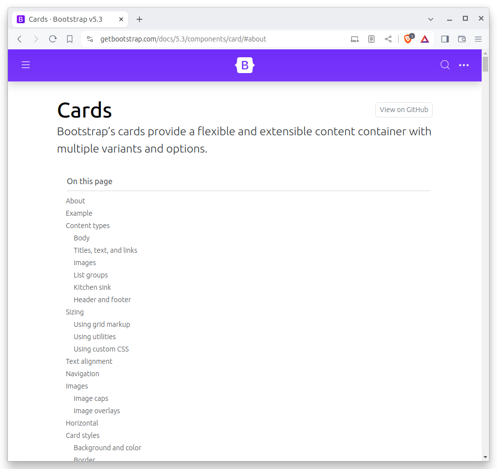
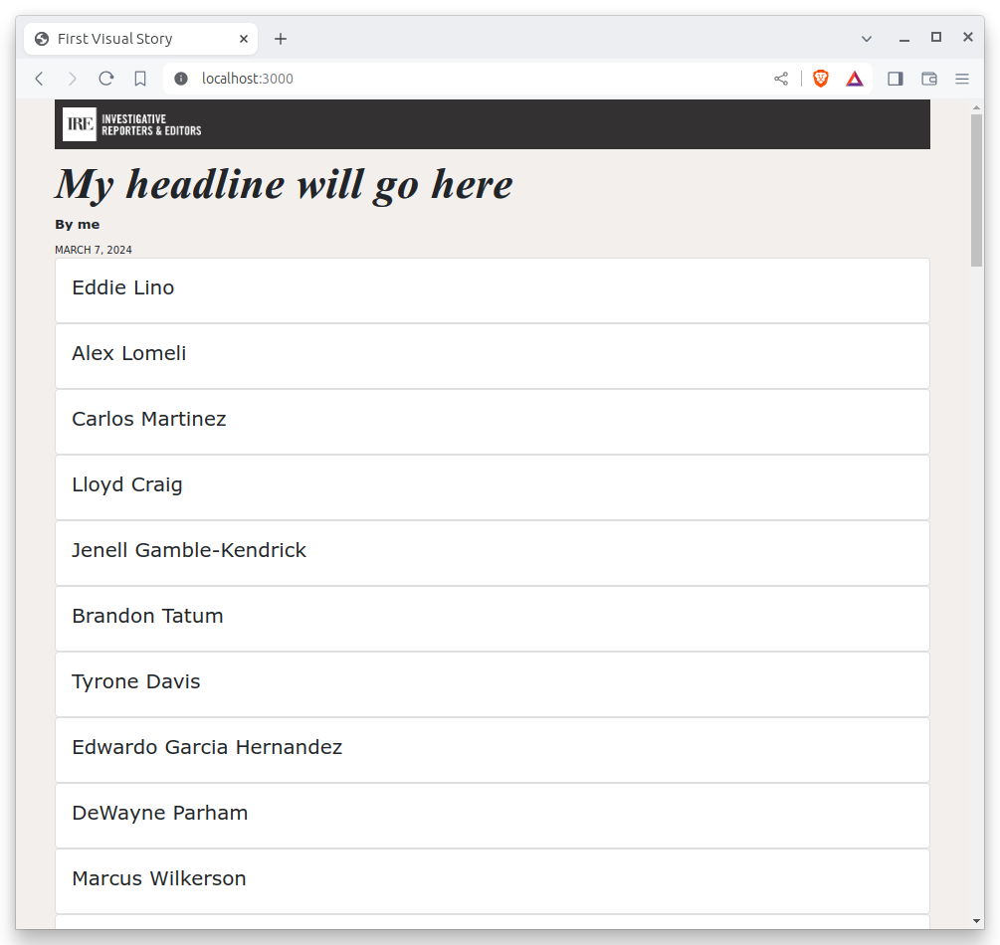
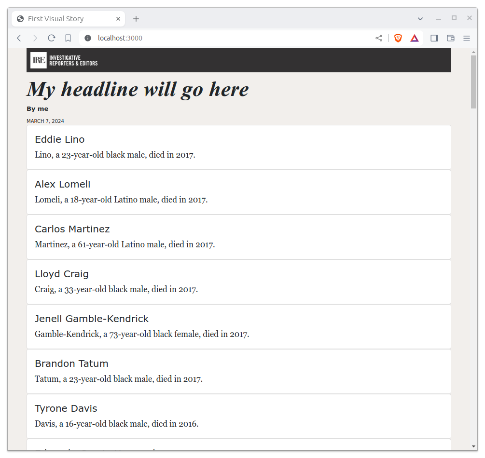
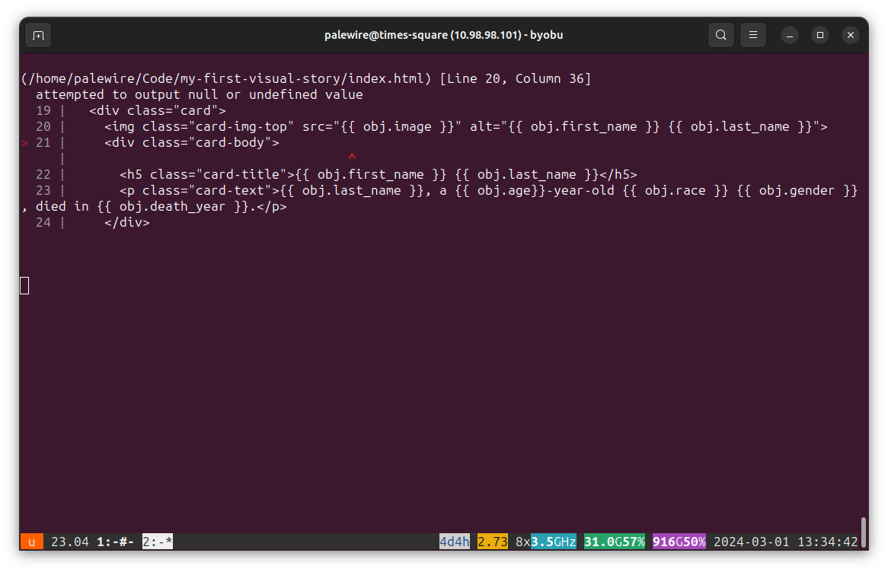
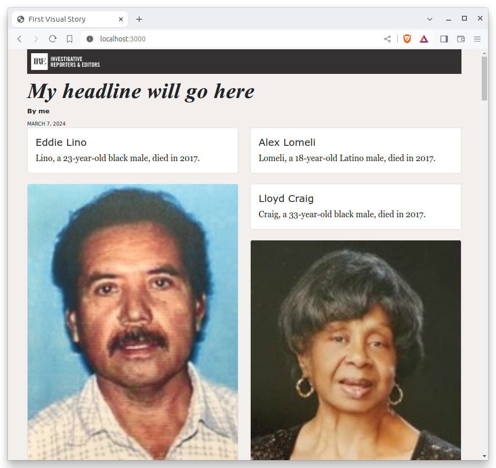
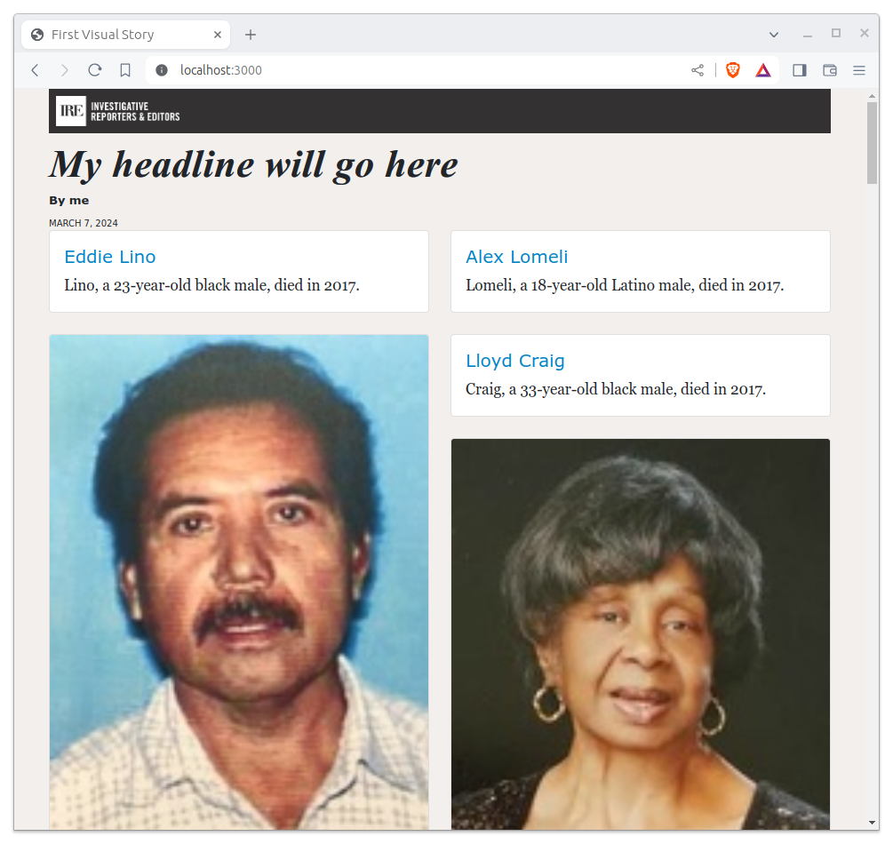
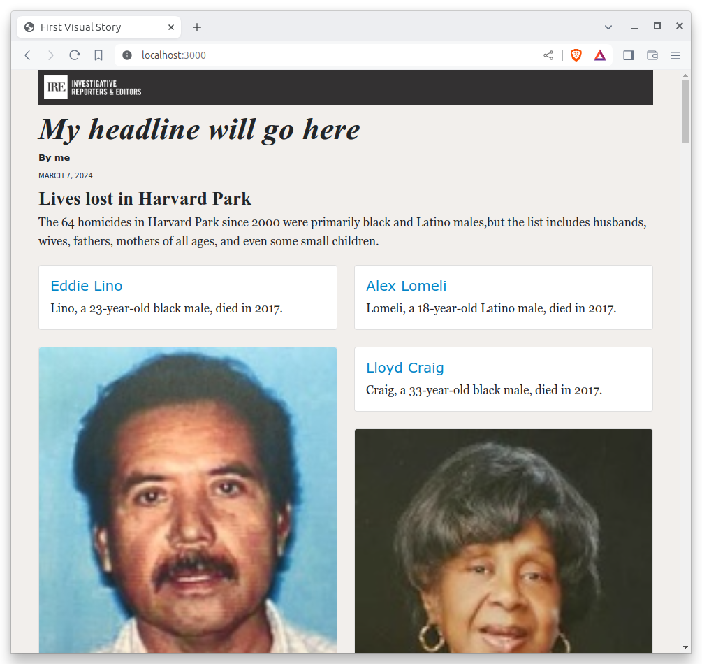

# HTML

This chapter will guide you through converting your list of names into a grid with photographs.

## Meet Bootstrap

[Bootstrap](https://getbootstrap.com/docs/5.1/getting-started/introduction/) is a free toolkit for designing the cosmetic face of web applications. It is a collection of ready-to-use pieces you can mix and match to jumpstart a project. It includes useful things that you might include in any project, like buttons, modals and dropdowns.


We aim to create a grid of victims where each block will have a picture and some basic information. To do this, we’re going to use [the "cards" component](https://getbootstrap.com/docs/4.4/components/card/) included in Bootstrap's version 5. Cards are self-contained boxes of information which can be arranged and grouped on a page any way you want.



## Add division tags

First, we need to set up our grid. To do that, we need to talk about [HTML's division tag](https://www.w3schools.com/Tags/tag_div.asp), also known as a `<div>`. In simple terms, a division is a container. Like any container, it holds things. Divisions can be nested inside of each other, like putting one box inside another box.

This is how Bootstrap cards work. Each card is a container which has additional containers inside it to hold, in this example, a picture, the victim's name, age, race and when he or she was killed.

Like other HTML tags, divisions can have `class` attributes that help identify their function and link them to cosmetic styles. Bootstrap provides us with a standard layout of boxes that, if structured and labeled properly, will instantly snap together to look like cards.

Let's give it a try. We will start by creating a container for each victim. We'll add just the name of the first and last name of each victim first.

```{code-block} jinja
:emphasize-lines: 3-7



    <div class="card">
      <div class="card-body">
        <h5 class="card-title">{{ obj.first_name }} {{ obj.last_name }}</h5>
      </div>
    </div>


```



Let's add a sentence below the name that summarizes who each victim was and when they died.

```{code-block} jinja
:emphasize-lines: 5


    <div class="card">
      <div class="card-body">
        <h5 class="card-title">{{ obj.first_name }} {{ obj.last_name }}</h5>
        <p class="card-text">{{ obj.last_name }}, a {{ obj.age}}-year-old {{ obj.race }} {{ obj.gender }}, died in {{ obj.death_year }}.</p>
      </div>
    </div>

```



## Add images

Now let's add each victim's image to their card.

```{code-block} jinja
:emphasize-lines: 3


    <div class="card">
      
      <div class="card-body">
        <h5 class="card-title">{{ obj.first_name }} {{ obj.last_name }}</h5>
        <p class="card-text">{{ obj.last_name }}, a {{ obj.age}}-year-old {{ obj.race }} {{ obj.gender }}, died in {{ obj.death_year }}.</p>
      </div>
    </div>

```

Ugh. You save and nothing changes on localhost. What’s wrong? When in doubt, take a look at your terminal. You should see something like this:



Baker has raised an error. Look carefully and you can see it’s telling you that `attempted to output null or undefined value`. This means you tried to print something in your template that doesn’t exist. Check your data and you’ll see that not every victim has an image. So trying to print one for every iteration of the loop caused a crash.

To fix it, let's add an `` clause around the image tag to check for an image in the data. This way, our code will loop through the list of victims and if there is an image it will add it to the right card. If not, the code will skip ahead to the next row.

```{code-block} jinja
:emphasize-lines: 3


    <div class="card">
      
      <div class="card-body">
        <h5 class="card-title">{{ obj.first_name }} {{ obj.last_name }}</h5>
        <p class="card-text">{{ obj.last_name }}, a {{ obj.age}}-year-old {{ obj.race }} {{ obj.gender }}, died in {{ obj.death_year }}.</p>
      </div>
    </div>

```

The error should go away and you should see something more like this in your browser.


Phew. That’s better, but still far from what we want. What we've got so far is a grid that doesn't look much like a grid. In fact it's not a grid at all. It's just a big stack.

## Create a grid

To arrange our cards using Bootstrap’s system, we need to play by Bootstrap's rules.

Look at [its documentation](https://getbootstrap.com/docs/5.1/examples/masonry/) and you’ll see that Bootstrap asks us to wrap our cards in a div with the class `row` and a special attribute required by Masonry, the Javascript tool that will layout the page. It also wants us to use some special Bootstrap classes to dictate how wide our cards will be.

Make the following changes. Remember there’s no shame in using copy and paste. And don't miss that the new division is outside of our for loop, meaning it only appears on the page once with all of the cards inside of it.


```{code-block} jinja
:emphasize-lines: 1,3,11,13

<div class="row" data-masonry='{"percentPosition": true }'>
    
    <div class="col-sm-6 col-lg-4 mb-4">
    <div class="card">
      
      <div class="card-body">
        <h5 class="card-title">{{ obj.first_name }} {{ obj.last_name }}</h5>
        <p class="card-text">{{ obj.last_name }}, a {{ obj.age}}-year-old {{ obj.race }} {{ obj.gender }}, died in {{ obj.death_year }}.</p>
      </div>
    </div>
    </div>
    
</div>
```



We want to be able to click on each card and be redirected to the victim's page on the Los Angeles Times Homicide Report site. While we're at it, let's add some `<strong>` tags to the victims' names to make them stand out from the sentence about them.

```{code-block} jinja
:emphasize-lines: 7-11

<div class="row" data-masonry='{"percentPosition": true }'>
    
    <div class="col-sm-6 col-lg-4 mb-4">
    <div class="card">
      
      <div class="card-body">
        <a href="http://homicide.latimes.com/post/{{ obj.slug }}" target="_blank">
            <strong>
                <h5 class="card-title">{{ obj.first_name }} {{ obj.last_name }}</h5>
            </strong>
        </a>
        <p class="card-text">{{ obj.last_name }}, a {{ obj.age}}-year-old {{ obj.race }} {{ obj.gender }}, died in {{ obj.death_year }}.</p>
      </div>
    </div>
    </div>
    
</div>
```



## Add supporting elements

Now let's start to wrap things up by writing a headline for our cards section.

```{code-block} jinja
:emphasize-lines: 1

<h3>Lives lost in Harvard Park</h3>
<div class="row" data-masonry='{"percentPosition": true }'>
    
    <div class="col-sm-6 col-lg-4 mb-4">
    <div class="card">
      
      <div class="card-body">
        <a href="http://homicide.latimes.com/post/{{ obj.slug }}" target="_blank">
            <strong>
                <h5 class="card-title">{{ obj.first_name }} {{ obj.last_name }}</h5>
            </strong>
        </a>
        <p class="card-text">{{ obj.last_name }}, a {{ obj.age}}-year-old {{ obj.race }} {{ obj.gender }}, died in {{ obj.death_year }}.</p>
      </div>
    </div>
    </div>
    
</div>
```


And now, some introductory text. We can use a new templating trick, the `length` filter, to insert some automatically generated statistics into the text.

```{code-block} jinja
:emphasize-lines: 2-6

<h3>Lives lost in Harvard Park</h3>
<p>
  The {{ harvard_park_homicides|length }} homicides in Harvard Park since 2000
  were primarily black and Latino males,but the list includes husbands, wives,
  fathers, mothers of all ages, and even some small children.
</p>
<div class="row" data-masonry='{"percentPosition": true }'>
    
    <div class="col-sm-6 col-lg-4 mb-4">
    <div class="card">
      
      <div class="card-body">
        <a href="http://homicide.latimes.com/post/{{ obj.slug }}" target="_blank">
            <strong>
                <h5 class="card-title">{{ obj.first_name }} {{ obj.last_name }}</h5>
            </strong>
        </a>
        <p class="card-text">{{ obj.last_name }}, a {{ obj.age}}-year-old {{ obj.race }} {{ obj.gender }}, died in {{ obj.death_year }}.</p>
      </div>
    </div>
    </div>
    
</div>
```



## Commit your work

We're all done here. So let's commit our work for this chapter.

First add.

```bash
git add .
```

Then commit.

```bash
$ git commit -m "Created a victims card grid"
```

Then push.

```bash
git push origin main
```
