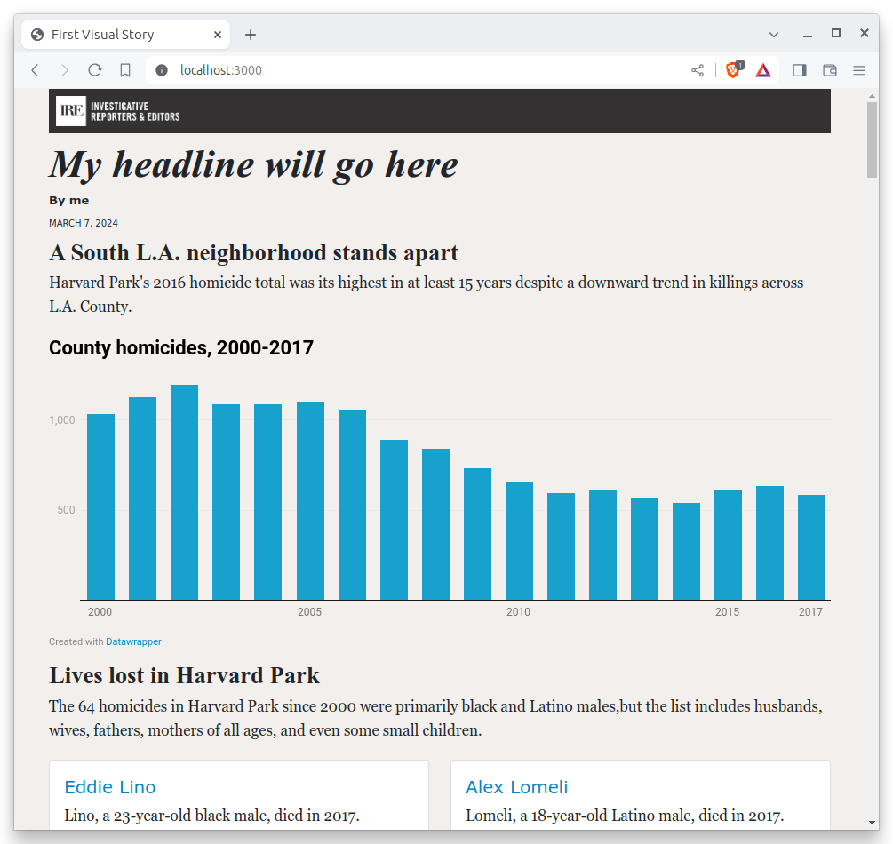
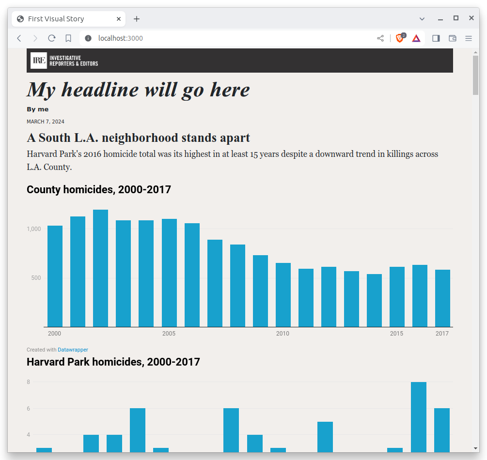

# Embeds

You won't have to code up every element yourself. Visual stories often include assets hosted elsewhere, like videos from YouTube or maps from Mapbox. In those cases, you may be given ready-to-serve components that you only need to embed in the page.

In HTML this is typically done with an HTML [frame](https://en.wikipedia.org/wiki/Frame_(World_Wide_Web)) Using a special tag called an [`<iframe>`](https://developer.mozilla.org/en-US/docs/Web/HTML/Element/iframe) you can nest a separate HTML document within the current page. It essentially creates a window through which another webpage can be viewed. The page being embedded is specified by the `src` attribute of the `iframe` element. For instance, this snippet will create a frame of https://example.com that is 500 pixels wide and 300 pixels high. 

```html
<iframe src="https://example.com" width="500" height="300"></iframe>
```

## Embedding Datawrapper charts

[Datawrapper](https://www.datawrapper.de/) is a free site where you can make charts and maps without having to write any code. It offers frame tags that can easily be embedded in any HTML page. You can commonly find visual stories that rely on Datawrapper to make bar charts, line charts and other simple plots, which allows developers to focus their time on more ambitious components.

Ahead of this class, we have prepared two Datawrapper charts for inclusion in the page. [One](https://www.datawrapper.de/_/XSj9X/) shows a declining countywide trend in homicides. [The other](https://www.datawrapper.de/_/qvF1G/) tracks the same metric in Harvard Park.

```{note}
The [Datawrapper Academy](https://academy.datawrapper.de/) has documentation for making various types of charts, if you’re interested in learning more about the tool.
```

Before we begin, let's add a new section of the page where our charts will be embedded. We'll start with a heading and lead for the section. Paste the code below into your page.

```{code-block} html

<h3>A South L.A. neighborhood stands apart</h3>
<p>
  Harvard Park's 2016 homicide total was its highest in at least 15 years
  despite a downward trend in killings across L.A. County.
</p>
```


Add a new division tag with the class attribute `graphics-container` to hold the charts. Inside that, add two more division tags with the class `graphic` to hold each chart. Your HTML should look like this:

```{code-block} html
:emphasize-lines: 6-13

<h3>A South L.A. neighborhood stands apart</h3>
<p>
  Harvard Park's 2016 homicide total was its highest in at least 15 years
  despite a downward trend in killings across L.A. County.
</p>
<div class="graphics-container">
  <div class="graphic">
    <!-- first graphic’s embed code goes here -->
  </div>
  <div class="graphic">
    <!-- second graphic’s embed code goes here -->
  </div>
</div>
```

Now let’s put those embed codes and paste them within the division tags with the class `graphic`.

The iframe embed codes are located in the “Publish & Embed” step of each chart in Datawrapper. In cases where you make a chart yourself, you can find the code there. If you delegate the creation of an outside asset to a colleague, they can provide you with the necessary code.

Let's simulate that here. Here's the first chart:

```html
<iframe
  title="County homicides, 2000-2017"
  aria-label="Column Chart"
  id="datawrapper-chart-XSj9X"
  src="https://datawrapper.dwcdn.net/XSj9X/5/"
  scrolling="no"
  frameborder="0"
  style="width: 0; min-width: 100% !important; border: none;"
  height="350"
></iframe>
<script type="text/javascript">
  !(function () {
    'use strict';
    window.addEventListener('message', function (e) {
      if (void 0 !== e.data['datawrapper-height']) {
        var t = document.querySelectorAll('iframe');
        for (var a in e.data['datawrapper-height'])
          for (var r = 0; r < t.length; r++) {
            if (t[r].contentWindow === e.source)
              t[r].style.height = e.data['datawrapper-height'][a] + 'px';
          }
      }
    });
  })();
</script>
```

Copy that and paste inside the first placeholder division tag in the previous code block example. Your html should look something like this at the end:

```{code-block} html
---
emphasize-lines: 8-32
---
<h3>A South L.A. neighborhood stands apart</h3>
<p>
  Harvard Park's 2016 homicide total was its highest in at least 15 years
  despite a downward trend in killings across L.A. County.
</p>
<div class="graphics-container">
  <div class="graphic">
    <iframe
      title="County homicides, 2000-2017"
      aria-label="Column Chart"
      id="datawrapper-chart-XSj9X"
      src="https://datawrapper.dwcdn.net/XSj9X/5/"
      scrolling="no"
      frameborder="0"
      style="width: 0; min-width: 100% !important; border: none;"
      height="350"
    ></iframe>
    <script type="text/javascript">
      !(function () {
        'use strict';
        window.addEventListener('message', function (e) {
          if (void 0 !== e.data['datawrapper-height']) {
            var t = document.querySelectorAll('iframe');
            for (var a in e.data['datawrapper-height'])
              for (var r = 0; r < t.length; r++) {
                if (t[r].contentWindow === e.source)
                  t[r].style.height = e.data['datawrapper-height'][a] + 'px';
              }
          }
        });
      })();
    </script>
  </div>
  <div class="graphic">
    <!-- second graphic’s embed code goes here -->
  </div>
</div>
```



Now copy the code for the second chart.

```html
<iframe
  title="Harvard Park homicides, 2000-2017"
  aria-label="Column Chart"
  id="datawrapper-chart-qvF1G"
  src="https://datawrapper.dwcdn.net/qvF1G/4/"
  scrolling="no"
  frameborder="0"
  style="width: 0; min-width: 100% !important; border: none;"
  height="350"
></iframe>
<script type="text/javascript">
  !(function () {
    'use strict';
    window.addEventListener('message', function (e) {
      if (void 0 !== e.data['datawrapper-height']) {
        var t = document.querySelectorAll('iframe');
        for (var a in e.data['datawrapper-height'])
          for (var r = 0; r < t.length; r++) {
            if (t[r].contentWindow === e.source)
              t[r].style.height = e.data['datawrapper-height'][a] + 'px';
          }
      }
    });
  })();
</script>
```

And paste it in the second placeholder.

```{code-block} html
---
emphasize-lines: 35-59
---
<h3>A South L.A. neighborhood stands apart</h3>
<p>
  Harvard Park's 2016 homicide total was its highest in at least 15 years
  despite a downward trend in killings across L.A. County.
</p>
<div class="graphics-container">
  <div class="graphic">
    <iframe
      title="County homicides, 2000-2017"
      aria-label="Column Chart"
      id="datawrapper-chart-XSj9X"
      src="https://datawrapper.dwcdn.net/XSj9X/5/"
      scrolling="no"
      frameborder="0"
      style="width: 0; min-width: 100% !important; border: none;"
      height="350"
    ></iframe>
    <script type="text/javascript">
      !(function () {
        'use strict';
        window.addEventListener('message', function (e) {
          if (void 0 !== e.data['datawrapper-height']) {
            var t = document.querySelectorAll('iframe');
            for (var a in e.data['datawrapper-height'])
              for (var r = 0; r < t.length; r++) {
                if (t[r].contentWindow === e.source)
                  t[r].style.height = e.data['datawrapper-height'][a] + 'px';
              }
          }
        });
      })();
    </script>
  </div>
  <div class="graphic">
    <iframe
      title="Harvard Park homicides, 2000-2017"
      aria-label="Column Chart"
      id="datawrapper-chart-qvF1G"
      src="https://datawrapper.dwcdn.net/qvF1G/4/"
      scrolling="no"
      frameborder="0"
      style="width: 0; min-width: 100% !important; border: none;"
      height="350"
    ></iframe>
    <script type="text/javascript">
      !(function () {
        'use strict';
        window.addEventListener('message', function (e) {
          if (void 0 !== e.data['datawrapper-height']) {
            var t = document.querySelectorAll('iframe');
            for (var a in e.data['datawrapper-height'])
              for (var r = 0; r < t.length; r++) {
                if (t[r].contentWindow === e.source)
                  t[r].style.height = e.data['datawrapper-height'][a] + 'px';
              }
          }
        });
      })();
    </script>
  </div>
</div>
```

At this point, you should see something like this on your page:



It ain’t pretty, but it’s a start. We’ll make it look better in the next section.

But before we do that, let's commit our changes and push them to GitHub. We need all the practice we can get.

First add.

```bash
git add .
```

Then commit.

```bash
$ git commit -m "Embedded datawrapper charts"
```

Then push.

```bash
git push origin main
```

