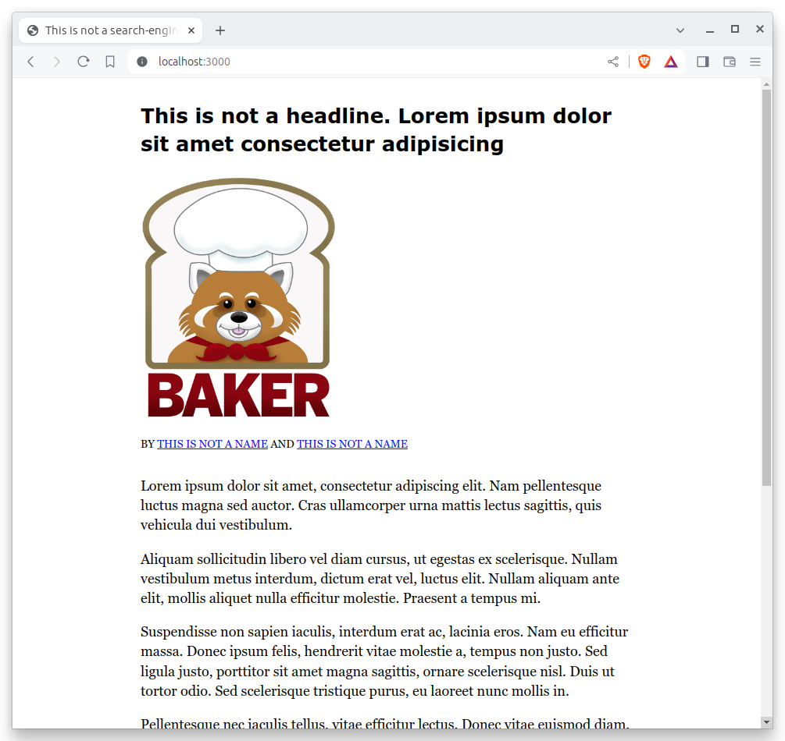

# Framework

Now that we have our git repository, we’re going to install the tools we need to start building a page.

## What is a framework?

The first and more important is our [framework](https://en.wikipedia.org/wiki/Software_framework).

What's that? Nothing more than fancy name for a set of software tools that, working together, can stand up a website.

It takes dozens of different software tricks to pull a good site together. Frameworks aim to make the challenge easier by curating a set of time-saving tools.

There are a lot of different frameworks out there. Maybe you've heard of some them, like [Django](https://www.djangoproject.com/) for Python, [Rails](http://rubyonrails.org) for Ruby or [React](https://reactjs.org/) for Node.js.

Each newsroom tends to go its own way, picking and choosing among the most popular tools. While the programming languages and the details vary from shop to shop, the fundamentals are almost all the same.

The GitHub template we cloned in the last chapter is a demonstration of the Los Angeles Times tool, which is known as [baker](https://github.com/datadesk/baker). It is published as free and open software that anyone can easily reuse at [github.com/datadesk/baker-example-page-template](https://github.com/datadesk/baker-example-page-template). It's also been used by developers at ProPublica, The City and The Baltimore Banner.

```{note}
Other newsroom frameworks have been released as open-source software, such as:

- Reuters’ [graphics-kit](https://github.com/reuters-graphics/bluprint_graphics-kit)
- The City's [react-template](https://github.com/thecityny/react-template)
- The Texas Tribune’s [data-visuals-create](https://github.com/texastribune/data-visuals-create)
- The Seattle Times' [newsapp-template](https://github.com/seattletimes/newsapp-template/)
- The NPR Apps team's [dailygraphics](https://github.com/nprapps/dailygraphics)
```

## Install our system

The Times’ baker framework — like most of its peers — is developed using the Node.js programming language.

Installing the underlying dependencies necessary to develop a page requires that you use Node.js’s package manager `npm`.

From your terminal, positioned inside of the repository’s directory, run the following to install everything necessary to start work:

```bash
npm install
```

## Start the test server

Once the dependencies have been installed, you’re ready to preview the project. Run the following to start the test server:

```bash
npm start
```

Visit [localhost:3000](http://localhost:3000) in your browser. There you can see the generic website offered as a starting point by our framework.



Congratulations, you’ve got your framework up and running. Now we’re ready to start developing our story.
