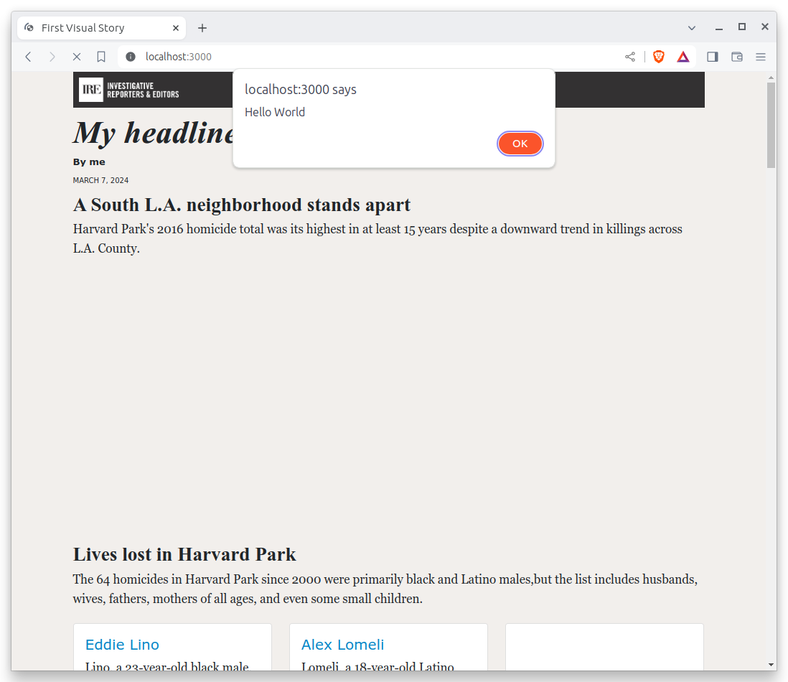
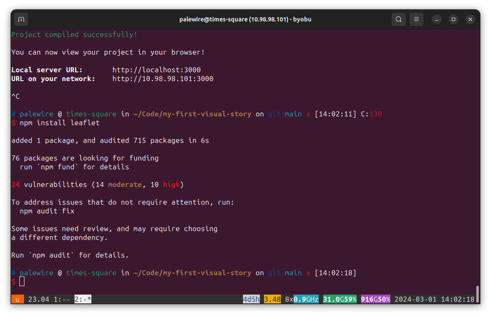
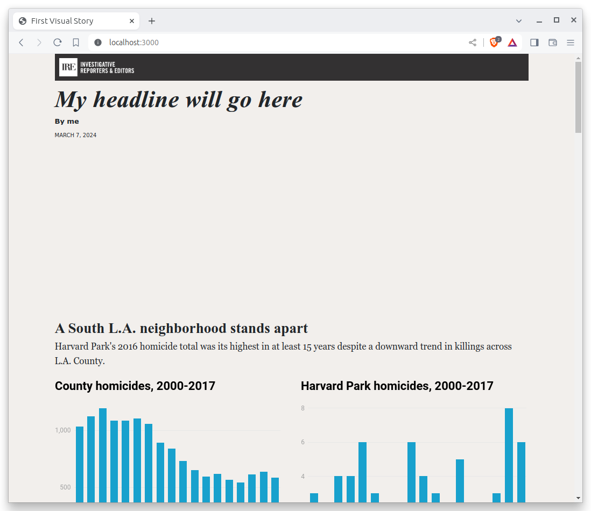
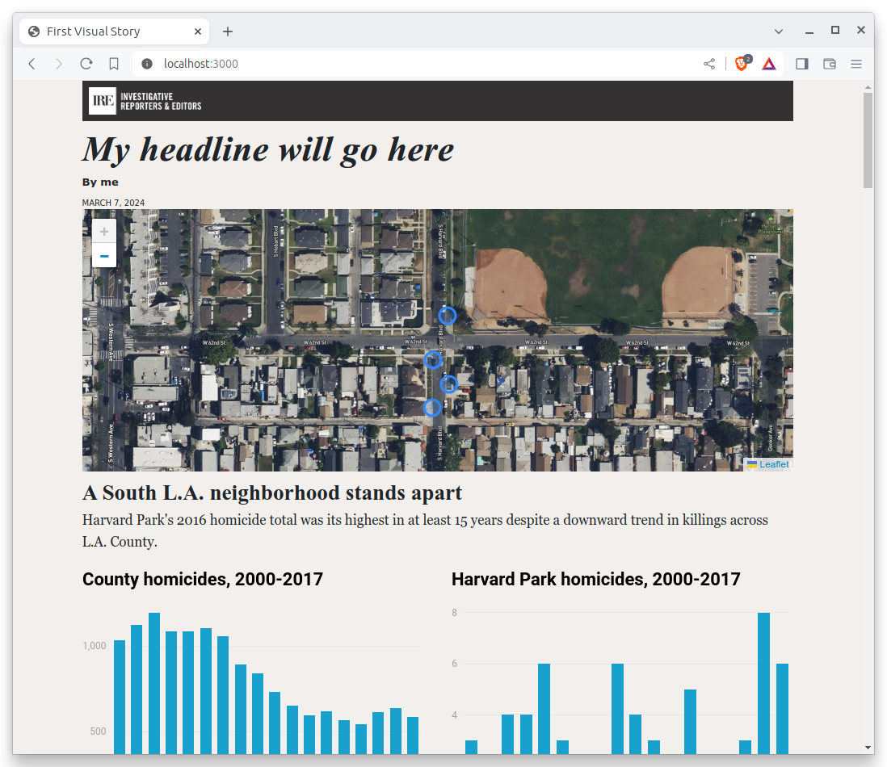
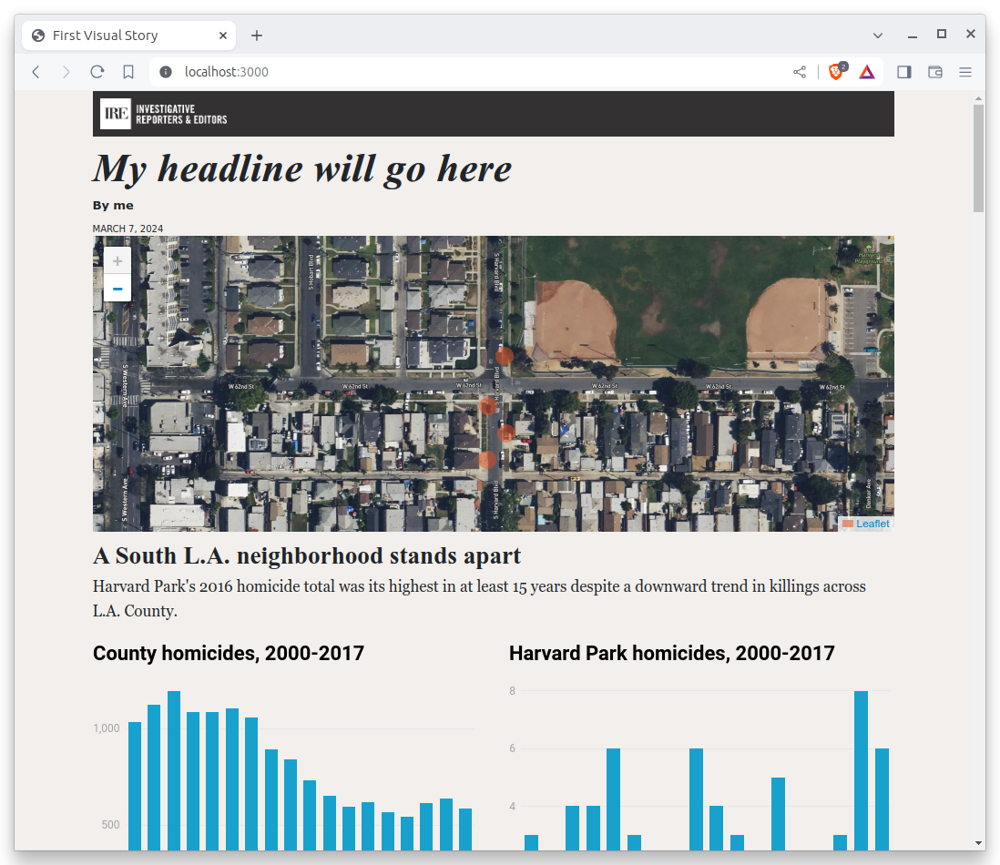
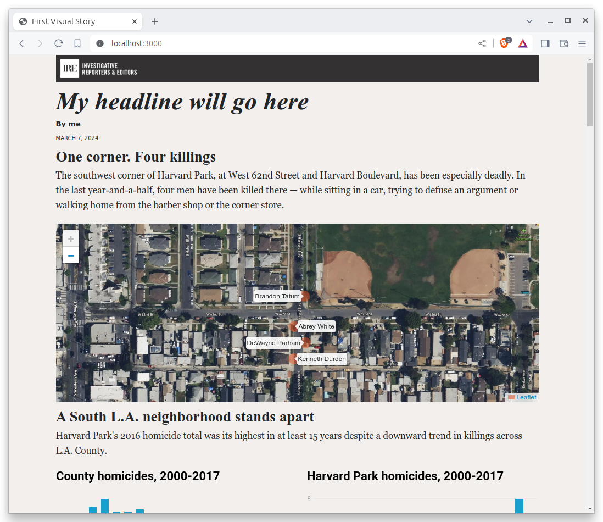
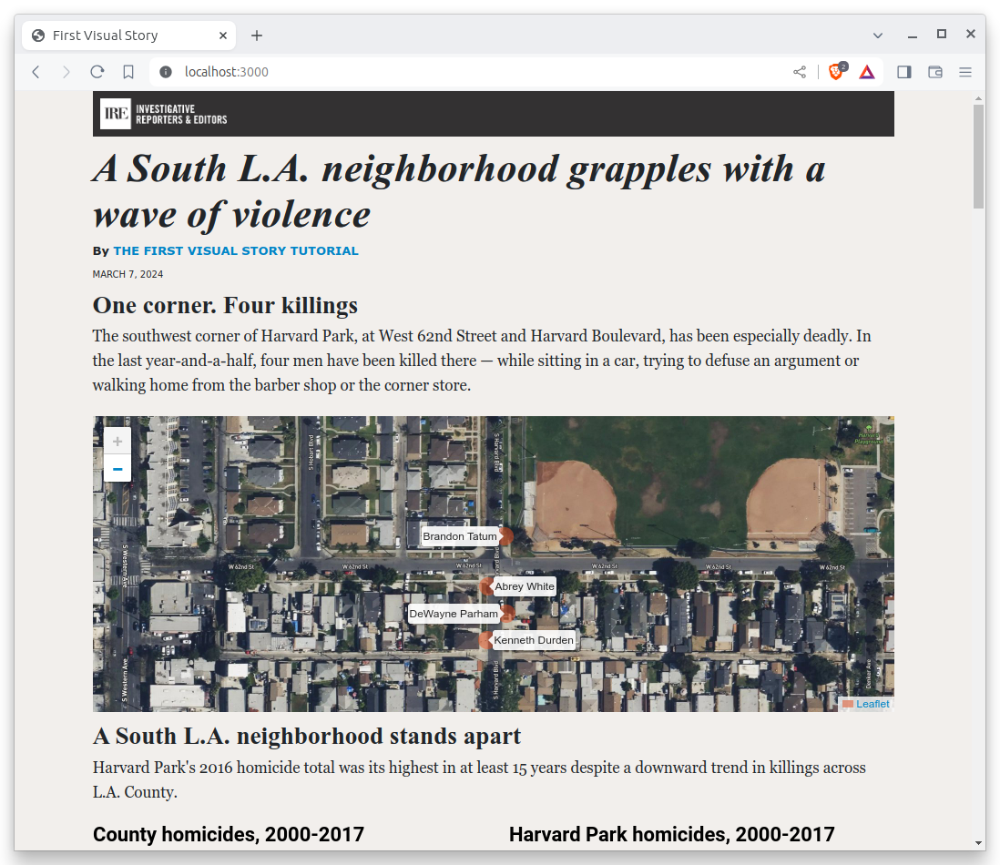

# Scripts

Next we'll move on to our final graphic element: a map focused on West 62nd Street and Harvard Boulevard, an intersection in South Los Angeles where four men died in less than a year and a half. To do this, we'll need yet another programming language, and perhaps the most important one for the web: JavaScript.

## What is JavaScript?

[JavaScript](https://en.wikipedia.org/wiki/JavaScript) is a programming language that can be run by a browser. It powers almost every interactive feature on the web, from simple animations to complicated applications like Google Maps. It is also the language that powers the interactivity in the Datawrapper charts we embedded in an earlier chapter.

To draw our map we will rely on [Leaflet](http://leafletjs.com), a JavaScript library that makes it easy to make a map. Learning how to write JavaScript and everything it takes to create a Leaflet map is beyond the scope of this class, But, as with CSS, we can quickly cover the broad outlines of how JavaScript code is included in a framework.

## The entrypoint

Most of today's frameworks offer a file that is the starting point for the JavaScript code execution. Commonly known as the entrypoint, it is booted up when the page loads. In the case of baker, that file is called `app.js` and it is found in the `scripts` directory. You can put whatever JavaScript code you'd like in the folder, but it's the `app.js` file that will be the first to run.

Let's test it out by opening up `app.js` and inserting a single, simple line of JavaScript.

```{code-block} javascript
alert("Hello World");
```

Save the file and reload your page. You should see a popup that reads "Hello World," an action triggered by JavaScript's built-in [`alert`](https://developer.mozilla.org/en-US/docs/Web/API/Window/alert) function.



## Installing dependencies

Before we start writing code there, we'll need to install Leaflet. Since it is maintained by a community of volunteers and not included with Node.js by default, we will need to download it using the `npm` tool we used earlier. That can be done by providing Leaflet's unique identifier [in the Node Package Manager](https://www.npmjs.com/package/leaflet) to the `npm install` command. Hit `CTRL-C` to stop the server and run the following command in your terminal.

```bash
npm install leaflet
```

You should see it print something like this:



Next we import Leaflet's stylesheets in `styles/app.scss` so that they are also included on our site. We do this by using `@use` and the path to a file.

```{code-block} css
:emphasize-lines: 4

// RESET
// Smooths out the rough edges across browsers
@use './tools/normalize';
@use 'node_modules/leaflet/dist/leaflet';

// VARIABLES
```

Now, back in the `index.html` template, we should create a placeholder in the page template where the map will live. Let's set it right above the charts section we've just finished. We will set the `id` attribute to give our `div` a unique identifier we can use later in our JavaScript.

```{code-block} jinja
:emphasize-lines: 1

<div id="map"></div>

<h3>A South L.A. neighborhood stands apart</h3>
<p>Harvard Park's 2016 homicide total was its highest in at least 15 years despite a downward trend in killings across L.A. County.</p>
```

To bring the map to life, open the `app.js` file and paste in the following block of code, which will import our data file and make a simple Leaflet map.

```{code-block} javascript
// Import dependencies
import * as L from 'leaflet';

// Import data
import homicides from '../_data/harvard_park_homicides.json';

// Set the id of the div on the page where the map will go
const divId = undefined;

// Create the map
const map = L.map(divId, {
  scrollWheelZoom: false,
});

// Add a map layer
L.tileLayer(
  'https://tile.openstreetmap.org/{z}/{x}/{y}.png',
  {
    attribution: '&copy; <a href="https://www.openstreetmap.org/copyright">OpenStreetMap</a> contributors',
    minZoom: 13,
  }
).addTo(map);

// Set the center and zoom
map.setView([33.983265, -118.306799], 18);

// Load the data
homicides.forEach((obj) => {
  L.circleMarker([obj.latitude, obj.longitude])  // As a pin ...
    .addTo(map)
    .bindTooltip(obj.first_name + ' ' + obj.last_name);  // ... with a tooltip
});
```

Save the file. Return to your terminal and restart the test server with:

```bash
npm start
```

Your map will not appear.



That's because we need to connect our JavaScript to the `div` container on our page that will hold the map. Leaflet does this by accepting the `id` element of the destination `div`. Edit `app.js` to set the `divId` variable that's now defined to our id. Make sure to put it in quotes.

```{code-block} javascript
:emphasize-lines: 8
// Import dependencies
import * as L from 'leaflet';

// Import data
import homicides from '../_data/harvard_park_homicides.json';

// Set the id of the div on the page where the map will go
const divId = "map";

// Create the map
const map = L.map(divId, {
  scrollWheelZoom: false,
});

// Add a map layer
L.tileLayer(
  'https://tile.openstreetmap.org/{z}/{x}/{y}.png',
  {
    attribution: '&copy; <a href="https://www.openstreetmap.org/copyright">OpenStreetMap</a> contributors',
    minZoom: 13,
  }
).addTo(map);

// Set the center and zoom
map.setView([33.983265, -118.306799], 18);

// Load the data
homicides.forEach((obj) => {
  L.circleMarker([obj.latitude, obj.longitude])  // As a pin ...
    .addTo(map)
    .bindTooltip(obj.first_name + ' ' + obj.last_name);  // ... with a tooltip
});
```

Here's what you should see after you do that. A real map.



## Styling the data

Next let's add some styles to our page to make the circles match the orange color of the dots found on [The Homicide Report](https://homicide.latimes.com/). As we did with the charts, go to the `styles` folder and open `app.scss`. In that file, copy or write the following:

```css
#map path {
  fill: #e64d1f;
  fill-opacity: 0.5;
  stroke-opacity: 0;
}
```

After you save, here's what you'll get.



## Some final touches

If you want to make the tooltips visible all the time, edit the JavaScript in `scripts/map.js` to make the tooltips "permanent."

```{code-block} javascript
:emphasize-lines: 4

homicides.forEach(obj => {
    L.circleMarker([obj.latitude,  obj.longitude])
      .addTo(map)
      .bindTooltip(obj.first_name + " " + obj.last_name, {permanent: true});  // ... with a tooltip
});
```
Here they are.

```{image} _static/tooltips.png
:width: 100%
```

Finally, let's preface the map with a headline and introductory paragraph

```{code-block} html
:emphasize-lines: 1-7

<h3>One corner. Four killings</h3>
<p>
   The southwest corner of Harvard Park, at West 62nd Street and Harvard Boulevard,
   has been especially deadly. In the last year-and-a-half, four men have been
   killed there — while sitting in a car, trying to defuse an argument or
   walking home from the barber shop or the corner store.
</p>
<div id="map"></div>
```



Congratulations. You've created a custom map. Before we get on to the business of sharing it with the world, we need a couple more pieces here.

Hey. How about a headline for the whole package? We also need a byline and a lead for the whole piece.

```{code-block} html
:emphasize-lines: 1-5

A South L.A. neighborhood grapples with a wave of violence
By <a href="https://palewi.re/docs/first-visual-story/">The First Visual Story Tutorial</a>

    <time datetime="2025-03-09" pubdate>March 9, 2025</time>



<p>The area around Harvard Park was the deadliest place for African Americans in Los Angeles County last year, according to <a href="http://homicide.latimes.com/">The Times’ Homicide Report</a>. So far this year, six people have been killed. Most of the victims were black men.</p>

<h3>One corner. Four killings</h3>
<p>The southwest corner of Harvard Park, at West 62nd Street and Harvard Boulevard, has been especially deadly. In the last year-and-a-half, four men have been killed there — while sitting in a car, trying to defuse an argument or walking home from the barber shop or the corner store.</p>
<div id="map"></div>
```



With that,  you've got a complete package. Before we move on to publishing your piece, you know what you need to do.

Add your work.

```bash
git add .
```

Commit it.

```bash
git commit -m "Added map, headline and chatter"
```

Push to GitHub.

```bash
git push origin main
```

Now you’re ready. Let’s do it live.
