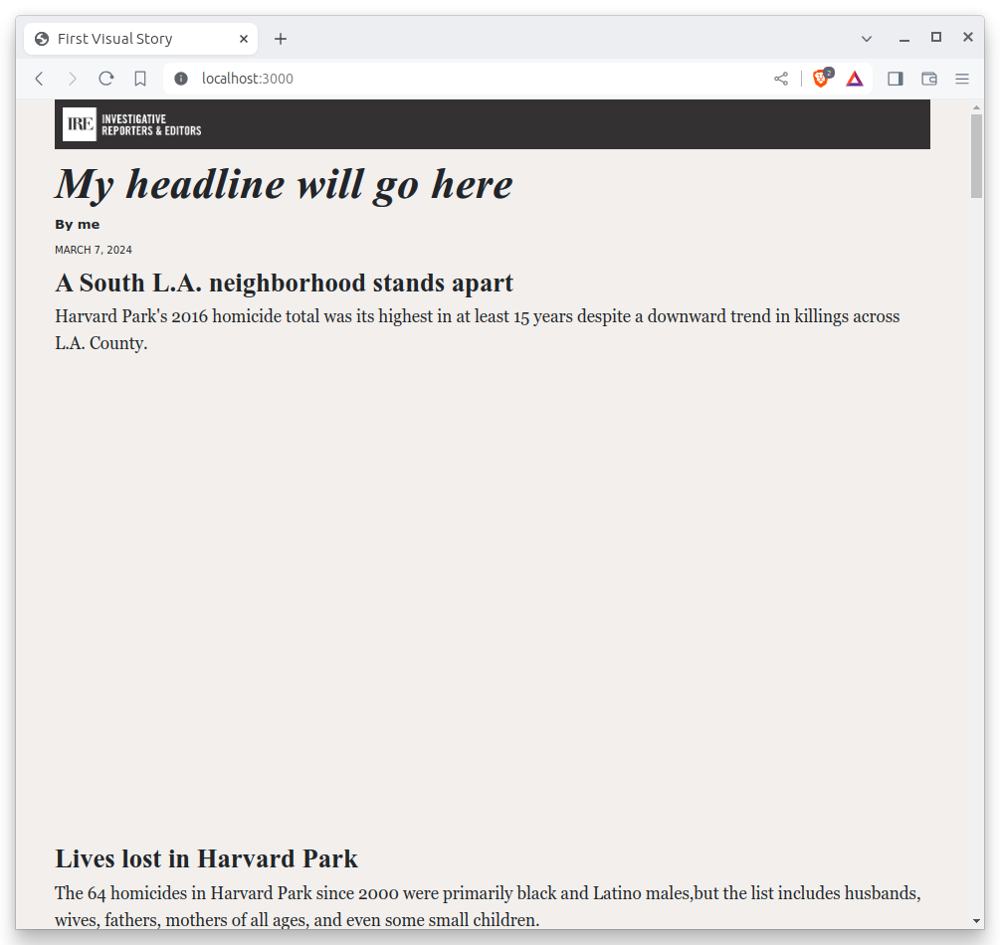
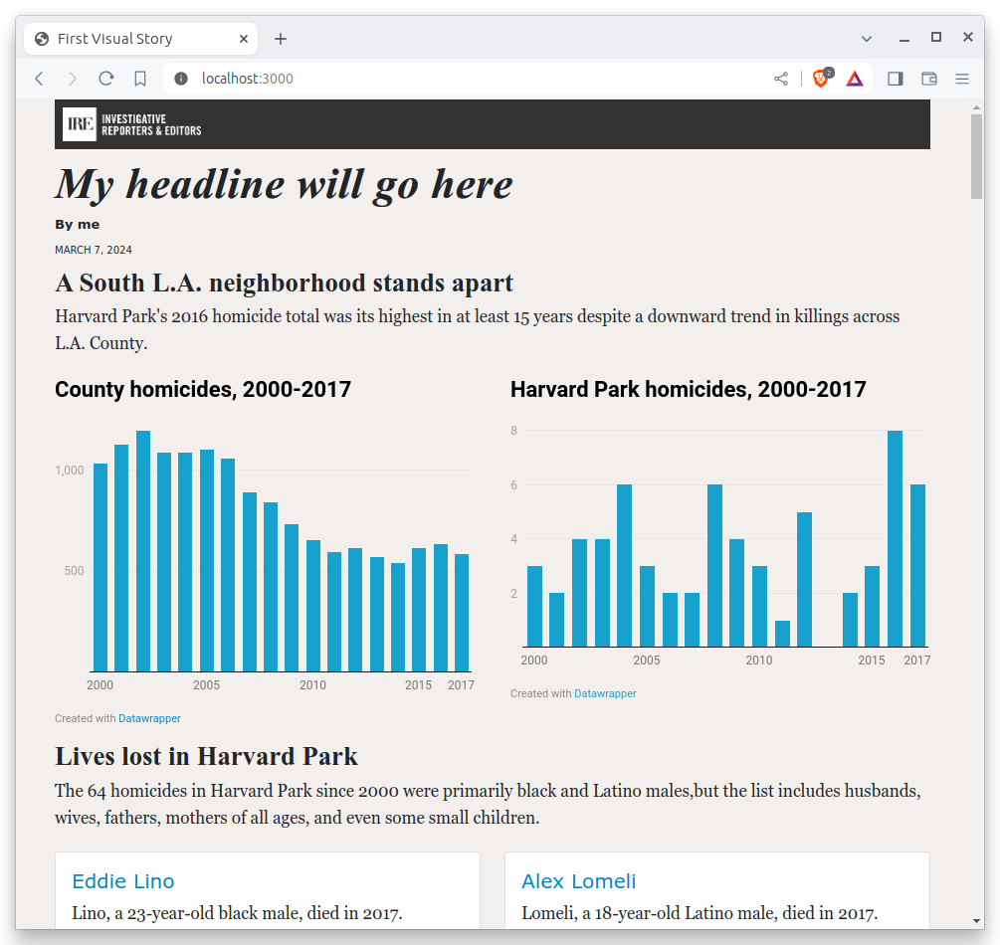
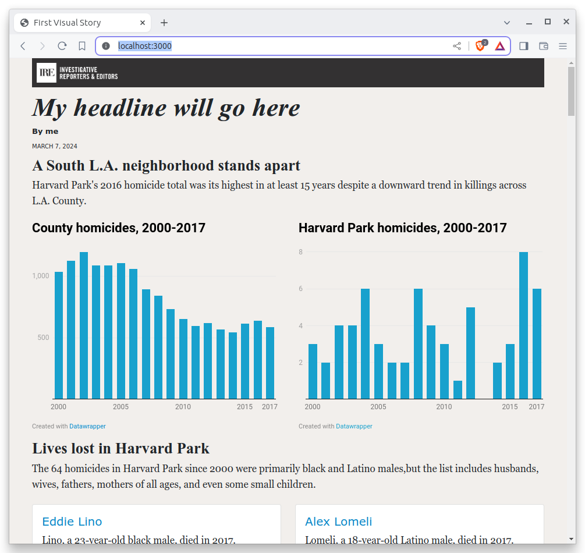
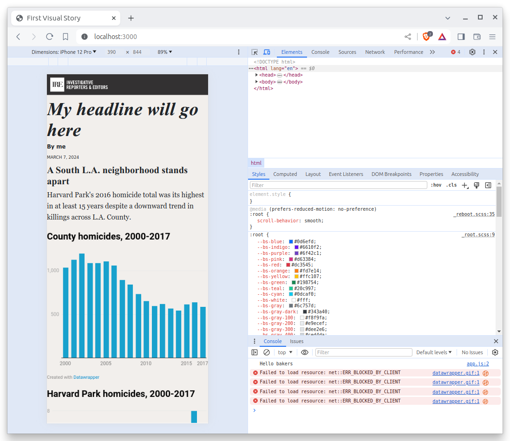

# Styles

We want the charts to be positioned side-by-side, so we will need to add some code that dictates the design of the page. To do that, we'll need yet another programming language.

## What is CSS?

Customizing design is typically done by writing [CSS](https://en.wikipedia.org/wiki/CSS) code. Short for Cascading Style Sheets, CSS allows developers to control the colors, fonts, layout and other visual elements of a webpage, while remaining separate from the HTML, which makes your code easier to maintain and update.

```{note}
We don't have time to fully cover how CSS works in this class. If you want to learn more, there are dozens of free tutorials available elsewhere online, including [an excellent one offered by Mozilla](https://developer.mozilla.org/en-US/docs/Learn/CSS/CSS_layout/Introduction).
```

Every decent framework offers some method for managing CSS. In baker's case, CSS files are stored in the `styles` folder. There you can find an `app.scss` file that acts as a starting point for whatever styles you'd like to include.

There we can get both charts on the same line by using the [Flexbox](https://developer.mozilla.org/en-US/docs/Web/CSS/CSS_Flexible_Box_Layout/Basic_Concepts_of_Flexbox) layout system. To start, lets target the `div` that contains the parent graphics container.

```{code-block}
.graphics-container {
  display: flex;
  justify-content: space-between;
}
```

The `.` at the beginning of `.graphics-container` is a [CSS class selector](https://developer.mozilla.org/en-US/docs/Web/CSS/Class_selectors) that targets the `div` with the class `graphics-container`. The `display: flex;` property tells the browser to use the Flexbox layout system, and `justify-content: space-between;` tells the browser to space the two charts as far apart as possible.

However, if you add this code to `app.scss` and refresh the page, you'll notice that there is nothing there. That's because our code isn't working just yet. We need a little more.



## What is SCSS?

One benefit of baker, and many other frameworks, is that they allow you to take advantage of extensions to the traditional tools like CSS. One example is SCSS, also known as [Sassy CSS](https://sass-lang.com/). It extends the capabilities of CSS with features such as variables, mixins and other functions that make writing and maintaining CSS code more efficient and organized.

We can use it here by nesting a directive to limit the width of the two charts to just shy of half the page. By placing the code inside of the parent container's code, we will only style the two elements in our container.

```{code-block}
:emphasize-lines: 4-6

.graphics-container {
  display: flex;
  justify-content: space-between;
  .graphic {
    flex: 0 1 48%;
  }
}
```

This change will give each of the graphics some instruction on how to behave within the parent container. The `flex` property tells the browser to allow the charts to scale up 48% of the available width.



Now that the charts are next to each other, we can see that despite our resizing in Datawrapper, they are not the same height. We’ll add a few more lines to our CSS to make both iframes the same height.

```{code-block}
---
emphasize-lines: 6-8
---
.graphics-container {
  display: flex;
  justify-content: space-between;
  .graphic {
    flex: 0 1 48%;
    iframe {
      min-height: 360px;
    }
  }
}
```



Much better.

## What is responsive design?

We can also specify media queries that target screens smaller than 500 pixels wide, more commonly known as mobile phones, where we want the charts to be stacked on top of each other instead of squeezed side by side.

```{code-block} scss
---
emphasize-lines: 4-6,9-12
---
.graphics-container {
  display: flex;
  justify-content: space-between;
  @media (max-width: 500px) {
    display: block;
  }
  .graphic {
    flex: 0 1 48%;
    @media (max-width: 500px) {
      display: block;
      margin-bottom: 15px;
    }
    iframe {
      min-height: 360px;
    }
  }
}
```

Your charts should now stack into one-column at mobile phone sizes.



There's plenty more that we could fine tune in our design, but we don’t have time today. This stage of development is often iterative, with many small changes made over time. The important thing for today is that you get a basic understanding of how CSS fits within a typical web development workflow.

Before we move on, let's commit our work yet again.

First add.

```bash
git add .
```

Then commit.

```bash
$ git commit -m "Styled datawrapper charts"
```

Then push.

```bash
git push origin main
```